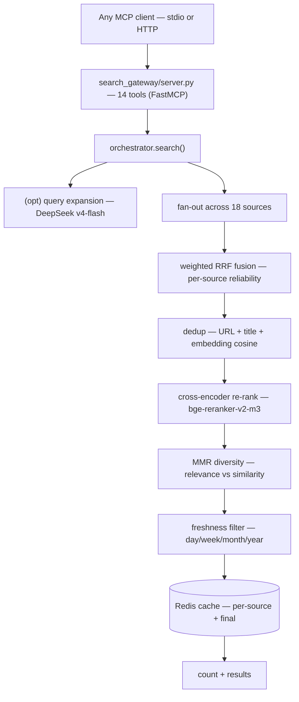

# search-gateway

One server, eighteen sources, one client-agnostic contract. `search-gateway` is
an MCP server that fuses the web, code, video, social, forum, and academic
worlds behind a single `search()` tool — then de-duplicates, fuses (weighted
RRF), re-ranks (cross-encoder), diversifies (MMR), and, via `research_answer`,
synthesizes a cited answer with DeepSeek.

It knows nothing about OpenCode, Claude Code, or any client. That is the point:
stdio by default, HTTP when you need a long-running host process, and the
`initialize`/`tools/list` handshake as the only source of truth for conformance.

## The pipeline, at a glance



## Quick start

```bash
pip install .               # or: pip install -e . for development
search-gateway check        # verified gate: 18 sources + Redis reachable, exit 0
search-gateway doctor       # full health report (18 sources)
search-gateway serve        # run the stdio MCP server
```

Register it in any MCP client (`docs/mcp-registration.md`; `mcp.json` is a
ready example), and bring up the two service dependencies with
`cd infra && docker compose up -d`.

## Tools (14)

`search`, `search_web`, `search_news`, `search_science`, `search_social`,
`search_academic`, `get_paper`, `get_citations`, `get_references`,
`research_answer`, `read_url`, `doctor`, `stats_report`, `saved_queries`.

Full argument/return schemas: `docs/api/tools.md`. The surface is a SemVer-major
contract, asserted against the live `tools/list` by `tests/test_contract.py` and
served over stdio by the bare `search-gateway` command (`tests/test_mcp_handshake.py`).

## Sources (18)

| Category | Sources |
|----------|---------|
| web | searxng, exa, web (`read_url`) |
| code | github, stackoverflow |
| video | youtube, bilibili |
| social | twitter, reddit, facebook, instagram, xiaohongshu, linkedin |
| forum | v2ex |
| academic | arxiv, openalex, crossref, semantic_scholar |

Sources degrade explicitly by capability tier; `search-gateway doctor` doubles
as the tier report (`docs/deployment.md`).

## CLI

| Command | Behavior |
|---------|----------|
| `search-gateway serve` | run the MCP server (default; `--transport stdio\|http\|sse`) |
| `search-gateway doctor` | health report as JSON, exit 0/1 |
| `search-gateway check` | strict gate (18 sources + Redis), for `ExecStartPre`/CI |
| `search-gateway version` | print `__version__` |
| `search-gateway warm` | preload rerank + embed models |

## Configuration

Everything is an environment variable with a default (`docs/config-reference.md`).
Secrets stay in `~/.agent-reach/*.env` (or a 0600 `EnvironmentFile`);
`.env.example` is the skeleton. One rule that surprises people: **logs go to
stderr, never stdout** — stdout is the MCP protocol wire.

## Orchestration skills

The research backbone (`deep-research`, `master-router`, `report`, `monitor`,
`research-rubric`) ships in `skills/` and is symlinked into your client's skill
dir with `./install.sh`. `diagram-design` arrives as a git submodule.

## Docs

| Doc | Covers |
|-----|--------|
| `docs/architecture.md` | pipeline + decoupling boundary |
| `docs/api/tools.md` | canonical 14-tool surface |
| `docs/meta-schema.md` | `Result.meta` contract |
| `docs/config-reference.md` | full env-var table |
| `docs/deployment.md` | tiers + docker/systemd/native |
| `docs/mcp-registration.md` | any-client registration |
| `docs/security.md` | threat model |
| `docs/voice.md` | the writing voice used here |
| `docs/history/` | project archaeology (TODO, tasks) |

## License

MIT — see `LICENSE`.
