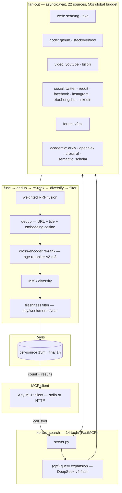
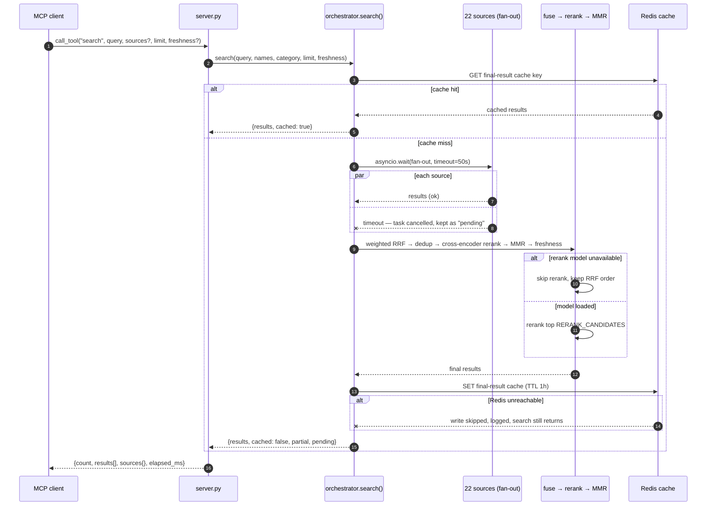
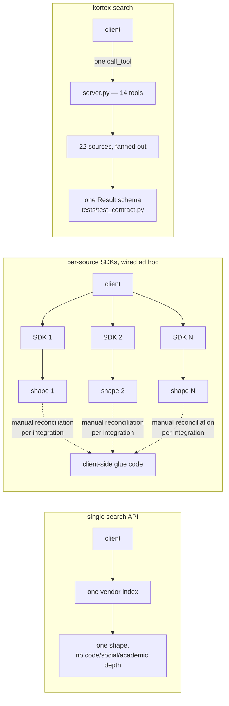

# kortex-search


<!-- ci badge placeholder: wire to .github/workflows/ci.yml once the hosted run is validated -->

One server, twenty-two sources, one client-agnostic contract. `kortex-search`
is an MCP server that fuses the web, code, video, social, forum, academic,
and Chinese-ecosystem worlds behind a single `search()` tool — then
de-duplicates, fuses (weighted RRF), re-ranks (cross-encoder), diversifies
(MMR), and, via `research_answer`, synthesizes a cited answer with DeepSeek.

The problem it kills is fragmentation. Without a gateway, every agent client
wires its own search — one API key per silo, no shared cache, no shared
reliability signal, results arriving in eighteen different shapes depending on
whether you asked Reddit or arXiv. Here there is exactly one contract: one
`search()` in, one `Result` schema out, and any MCP client gets the whole fused
web for the price of a handshake.

It knows nothing about OpenCode, Claude Code, or any client. That is the point:
stdio by default, HTTP when you need a long-running host process, and the
`initialize`/`tools/list` handshake as the only source of truth for conformance.

## Contents

- [The pipeline, at a glance](#the-pipeline-at-a-glance)
- [Request lifecycle](#request-lifecycle)
- [Why a gateway and not one search API](#why-a-gateway-and-not-one-search-api)
- [Quick start](#quick-start)
- [A taste of the output](#a-taste-of-the-output)
- [Tools (14)](#tools-14)
- [Sources (18)](#sources-18)
- [CLI](#cli)
- [Configuration](#configuration)
- [Versioning](#versioning)
- [Orchestration skills](#orchestration-skills)
- [Docs](#docs)
- [License](#license)

## The pipeline, at a glance

The gateway is four phases, not fourteen unrelated steps: a client speaks MCP,
the orchestrator fans out and fuses, a re-rank/diversity/freshness stage
sharpens the fused list, and a cache decides whether any of that needed to
happen at all. Grouping the diagram by phase — instead of one long chain of
boxes — is the point: it's the same pipeline as before, but now the four
questions a reader actually asks ("what talks MCP", "what actually fans out",
"what reorders the results", "what gets cached") each have their own visual
home.



Every stage after the fan-out degrades gracefully rather than failing the
request: a source that times out is simply absent from fusion, a model that
fails to load skips its stage, Redis being down skips the cache and nothing
else. The "Request lifecycle" diagram below walks that same shape under
failure; `docs/architecture.md` goes one level deeper still, with the full
reliability model.

## Request lifecycle

The flowchart above shows *what* the pipeline is made of. This shows what
actually happens, in order, for one call — including the two decision points
that matter most in practice: a source timing out, and the model or cache
layer being unavailable. `partial`/`pending` in the response envelope
(see "A taste of the output") are the direct output of the alt-branch below.



## Why a gateway and not one search API

The honest alternative to this repo is picking one search API and living with
its blind spots, or wiring N vendor SDKs by hand and eating the integration
cost forever. Side by side, the shapes of those three approaches make the
trade-off visible in a way the words alone undersell:



| Approach | Coverage | Reliability signal | Result shape | Cost of adding a vertical |
|----------|----------|--------------------|---------------|-----------------------------|
| Single search API (e.g. Bing/Google API only) | One index's view of the web | None — you get what it gives you | One shape, but no code/social/academic depth | Not possible — you're locked to the vendor's index |
| Per-source SDKs, wired ad hoc | As wide as you're willing to integrate | Manual, per-integration | N different shapes, N different clients to write | A new SDK, a new client, a new parser, every time |
| `kortex-search` | 22 sources across web/code/video/social/forum/academic/CN | Rolling 24h success rate feeds fusion weight automatically (`docs/adrs/0003-weighted-rrf.md`) | One `Result` schema, enforced by `tests/test_contract.py` | Subclass `Source`, emit `Result`, register in `ALL_SOURCES` (`docs/architecture.md`) |

The bet only pays off if degradation is explicit rather than silent — which is
why `doctor` reports per-source status and `search`'s response envelope always
says which sources are `ok`, `error`, or `pending (timeout)` rather than just
handing back whatever fused successfully and staying quiet about the rest.

## Quick start

```bash
pip install .                              # Python ≥ 3.12; or: pip install -e . for development
cd infra && docker compose up -d && cd ..  # Redis (AOF) + SearXNG (JSON, :8888)
kortex-search check                       # verified gate: 22 sources + Redis reachable, exit 0
kortex-search doctor                      # full health report (22 sources)
kortex-search serve                       # run the stdio MCP server
```

`check` exits 0 and prints:

```json
{
  "sources": 18,
  "redis": { "ok": true, "version": "7.x" },
  "llm": { "available": true }
}
```

<!-- capture: real `kortex-search check` output -->

Two things to expect on a fresh install. The first `search` takes roughly 30
seconds cold — the cross-encoder and bi-encoder load lazily on first use, and
`kortex-search warm` preloads them so the first live query is fast instead of
paying that latency on someone's actual request. And `llm.available` reads
`false` until `DEEPSEEK_API_KEY` is set: search itself works regardless, since
only `research_answer` and query expansion touch the key (`docs/faq.md`
explains exactly which features need it and which don't).

Register the server in any MCP client — `docs/mcp-registration.md` covers six
of them with copy-pasteable config, and `mcp.json` in this repo is a ready
example for the stdio path.

## A taste of the output

One `search` call — six default sources fanned out, fused, re-ranked,
diversified (abridged to one result so the envelope is legible):

```json
{
  "query": "reciprocal rank fusion vs cross-encoder reranking",
  "count": 3,
  "results": [
    {
      "title": "Example fused hit — a paper page two sources agree on",
      "url": "https://example.org/papers/rrf-vs-cross-encoder",
      "snippet": "An illustrative excerpt of the kind each source returns…",
      "source": "openalex",
      "engine": "openalex",
      "published": "2024-06-01",
      "score": 4.2103,
      "meta": {
        "source_type": "paper",
        "score_raw": 0.032051,
        "year": 2024,
        "is_oa": true,
        "_also_found_by": ["exa"]
      }
    }
  ],
  "sources": {
    "searxng": "ok (10)",
    "exa": "ok (10)",
    "github": "ok (10)",
    "youtube": "pending (timeout)",
    "bilibili": "ok (8)",
    "v2ex": "ok (6)"
  },
  "cached": false,
  "reranked": true,
  "partial": true,
  "pending": ["youtube"],
  "elapsed_ms": 18412
}
```

<!-- capture: real search output -->

Read the envelope, not just the results: `sources` reports each source as
`ok (n)` / `error: …` / `pending (timeout)`, and `partial: true` plus
`pending` names whoever missed the 50-second fan-out budget
(`KORTEX_SEARCH_TIMEOUT`) — a timed-out source never fails the whole request,
it's just absent, and the envelope tells you which one and why. That's the
alt-branch from the "Request lifecycle" diagram above, made concrete.

And `research_answer` — the same pipeline, then a DeepSeek synthesis scoped
strictly to the numbered sources ("use ONLY the numbered sources below… if the
sources don't answer it, say so rather than guessing"):

```json
{
  "answer": "RRF is order-only: a document's score is the sum over lists of w/(k + rank), so it needs no score calibration across sources. A cross-encoder scores query–document pairs directly and usually reorders the top candidates more sharply, at the price of CPU latency. Whether that latency pays off at small top-k is not settled by these sources [1][2].",
  "citations": [
    { "n": 1, "title": "Example fused hit — a paper page two sources agree on", "url": "https://example.org/papers/rrf-vs-cross-encoder" },
    { "n": 2, "title": "Example web hit — a reranker benchmark writeup", "url": "https://example.com/blog/reranker-benchmarks" }
  ],
  "results": [
    {
      "title": "Example fused hit — a paper page two sources agree on",
      "url": "https://example.org/papers/rrf-vs-cross-encoder",
      "snippet": "An illustrative excerpt of the kind each source returns…",
      "source": "openalex",
      "engine": "openalex",
      "published": "2024-06-01",
      "score": 4.2103,
      "meta": { "source_type": "paper", "score_raw": 0.032051, "year": 2024, "is_oa": true }
    }
  ],
  "sources": { "searxng": "ok (10)", "exa": "ok (10)" }
}
```

<!-- capture: real research_answer output -->

Notice what the tool does *not* do: it never drops the scoping instruction
even when the sources are thin, and an empty result set returns
`{"answer": "No results found to synthesize from.", "citations": [], "results": []}`
rather than letting the model guess.

## Tools (14)

`search`, `search_web`, `search_news`, `search_science`, `search_social`,
`search_academic`, `get_paper`, `get_citations`, `get_references`,
`research_answer`, `read_url`, `doctor`, `stats_report`, `saved_queries`.

Full argument/return schemas — plus a worked JSON example per tool and the
per-tool error semantics — live in `docs/api/tools.md`. The surface is a
SemVer-major contract, asserted against the live `tools/list` by
`tests/test_contract.py` and served over stdio by the bare `kortex-search`
command (`tests/test_mcp_handshake.py`) — so "does the client actually see 14
tools" is a testable claim here, not a hope.

## Sources (18)

| Category | Sources |
|----------|---------|
| web | searxng, exa, web (`read_url`) |
| code | github, stackoverflow |
| video | youtube, bilibili |
| social | twitter, reddit, facebook, instagram, xiaohongshu, linkedin |
| forum | v2ex |
| academic | arxiv, openalex, crossref, semantic_scholar |
| CN tier (opt-in) | zhihu, zhihu_hot, weibo, baidu, toutiao — enabled with `KORTEX_SEARCH_CN_SOURCES=1` |

Sources degrade explicitly by capability tier (23 registered) — `kortex-search doctor`
doubles as the tier report, and `docs/deployment.md` maps each tier to the
binaries and env vars it needs. Adding source #23 is a bounded, four-step
change documented in `docs/architecture.md`'s source-adapter contract.
The v0.4 extraction layer (`kortex_search/extract/`) adds tiered routing,
block detection, a browser profile farm, an env-gated proxy subsystem, and
multi-stage `read_url` — see `docs/extraction/LESSONS.md` (v0.4 build
lessons). Since 0.4.1 it also
carries the containment floor: an L1 egress filter (private/link-local/
metadata ranges, checked pre-nav and post-redirect), a per-persona secrets
vault (`kortex-search vault migrate|status`), and block-event telemetry in
`doctor`/`stats_report`. Since 0.4.2: an L2 forced-proxy for the anonymous
browser tier and a mandatory L3 kernel egress filter (`kortex-search harden
--install --sudo` — browser ops refuse to launch without it, D7.1).

## CLI

| Command | Behavior |
|---------|----------|
| `kortex-search serve` | run the MCP server (default; `--transport stdio\|http\|sse`) |
| `kortex-search doctor` | health report as JSON, exit 0/1 |
| `kortex-search check` | strict gate (22 sources + Redis), for `ExecStartPre`/CI |
| `kortex-search version` | print `__version__` |
| `kortex-search warm` | preload rerank + embed models |
| `kortex-search vault migrate [--dry-run]` | move legacy flat secrets into the per-persona vault |
| `kortex-search vault status` | vault layout + hygiene findings |
| `kortex-search harden --install\|--status\|--uninstall\|--check [--sudo]` | L3 kernel egress filter (nftables cgroupv2, mandatory D7.1) |

## Configuration

Everything is an environment variable with a default — all 82 of them,
grouped by concern and mapped to capability tiers in
`docs/config-reference.md`, with the override precedence (env var > env file >
default) spelled out once so it doesn't need re-deriving per variable. Secrets
stay in `~/.agent-reach/*.env` (or a 0600 `EnvironmentFile`); `.env.example` is
the skeleton. One rule that surprises people enough to repeat here: **logs go
to stderr, never stdout** — stdout is the MCP protocol wire, and anything that
writes to it corrupts the stdio transport.

## Versioning

SemVer, read from `kortex_search/__init__.py` (currently `0.2.0`). Adding a
tool is a **minor** bump. Removing or renaming a tool, or changing a `Result`
or return-field shape, is a **major** bump with a deprecation cycle — because
`docs/api/tools.md` and `docs/meta-schema.md` are the contract, and
`tests/test_contract.py` holds the gateway to it by checking the live
`tools/list` against exactly 22 sources, 14 tools, and the `Result` shape.
`docs/architecture.md#versioning` has the full rule set.

## Orchestration skills

The research backbone (`deep-research`, `master-router`, `report`, `monitor`,
`research-rubric`) ships in `skills/` and is symlinked into your client's skill
dir with `./install.sh`. `diagram-design` arrives as a git submodule. Both are
out of scope for this documentation pass — they're covered by their own
history, not rewritten here.

## Docs

| Doc | Covers |
|-----|--------|
| `docs/project-map.md` | whole-repo navigational map — vision & goals, layout, module map, sources, tools, reliability, tests, skills, ADRs |
| `docs/extraction/LESSONS.md` | running research journal — anti-bot field state, proxy economics, platform playbooks |
| `docs/extraction/proxy-funding-guide.md` | funding + provisioning the optional proxy tier |
| `docs/extraction/stealth-matrix.md` | nodriver vs Patchright vs Camoufox capability matrix + adoption triggers |
| `docs/architecture.md` | pipeline, request lifecycle, reliability model, source-adapter contract, decoupling boundary, design decisions, versioning |
| `docs/api/tools.md` | canonical 14-tool surface — args, returns, worked examples, error semantics |
| `docs/meta-schema.md` | `Result.meta` contract + one example per `source_type` |
| `docs/config-reference.md` | all 41 env vars, grouped, tier mapping, override precedence |
| `docs/deployment.md` | capability tiers, docker/systemd/native, troubleshooting, upgrade path |
| `docs/mcp-registration.md` | any-client registration — stdio vs HTTP, six clients, troubleshooting |
| `docs/security.md` | threat model, per-tool attack surface, hardening checklist |
| `docs/faq.md` | why 22 sources, model sizes, CJK behavior, adding a source, transports, PyPI, the DeepSeek key |
| `docs/adrs/` | six short ADRs — the standing design decisions, linked from `architecture.md` |
| `docs/voice.md` | the writing voice used across this documentation |
| `CONTRIBUTING.md` | setup, tests, lint, adding a source, release notes |

## License

MIT — see `LICENSE`.