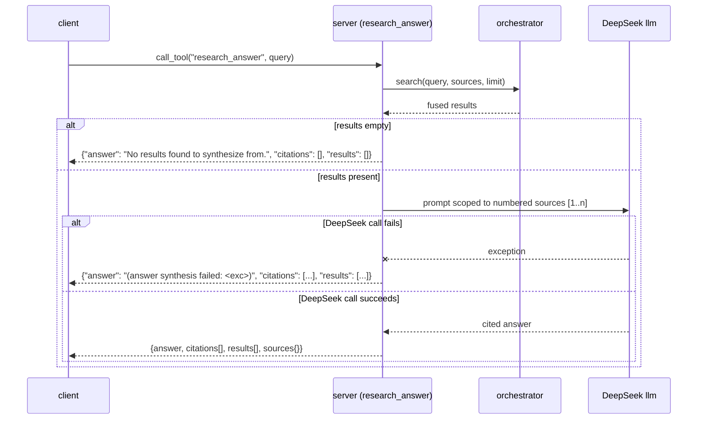

# MCP Tool Surface

The 14 MCP tools are the public API. Renaming a tool, removing one, or changing
a return field is a **major** version bump (`docs/architecture.md#versioning`).
Two tests hold this surface: `tests/test_contract.py` asserts 22 sources + 14
tools + `Result` shape against the live `tools/list`, and
`tests/test_mcp_handshake.py` proves the bare `search-gateway` command serves
it over stdio.

Every example on this page derives its return shape from `server.py` and
`orchestrator.py`. Values are plausible, not live-captured — anywhere marked
`<!-- capture: real ... -->` is meant to hold real output later, without
prose changes.

## Error semantics

There is no single error contract across all 14 tools, because they wrap
different failure surfaces — this table is the ground truth per tool.

| Tool | On failure |
|------|-----------|
| `search` / `search_web` / `search_news` / `search_science` / `search_academic` / `search_social` | Never raises to the client. A source that errors is reported as `sources[name] = "error: <type>: <message>"` and simply excluded from fusion; the response is still `{count, results[], sources{}}`. |
| `get_paper` | Per-sub-lookup errors are folded into the merged dict as `{"error": "<message>"}` under that sub-source's key (`arxiv`/`crossref`/`openalex`) — the tool itself always returns 200-shaped data, never raises. |
| `get_citations` / `get_references` | Falls back OpenAlex → Semantic Scholar (citations) or Crossref → OpenAlex → Semantic Scholar (references); if every engine fails, returns `{"identifier": ..., "error": "<message>"}` with no `results` key. |
| `research_answer` | Empty search results → `{"answer": "No results found to synthesize from.", "citations": [], "results": []}`. A DeepSeek failure → `{"answer": "(answer synthesis failed: <exc>)", "citations": [...], "results": [...]}` — the search results are never discarded even if synthesis fails. |
| `read_url` | `{"url": url, "error": "<message>"}` when every extraction stage fails — no partial content field. |
| `doctor` | Per-source probe failures appear as `"error: <message>"` string values inside `sources{}`; the tool call itself does not fail. |
| `stats_report` | Redis errors are swallowed inside `stats.snapshot()` (logged at `debug`) and simply omit that source's entry — never raises. |
| `saved_queries` | Unknown `action` → `{"error": "unknown action: <action> (save|list|delete|run|diff)"}`. `run`/`delete` on an unknown `name` → `{"error": "unknown saved query: <name>"}`. |

`doctor`'s per-source status strings follow one convention throughout:
`"ok"`, `"down"`, `"down — <reason>"`, or `"error: <exception>"` — `doctor`'s
`academic.<source>.rate_limited` flag derives from string-matching `"429"` or
`"rate"` in that same status string, so the convention is load-bearing, not
cosmetic.

## Search

### Response envelope

Every `search*` tool returns the same envelope, set in `orchestrator.search()`
(`orchestrator.py`):

| Key | Type | Meaning |
|-----|------|---------|
| `query` | str | the query as sent |
| `count` | int | `len(results)` |
| `results` | list | fused, deduped, re-ranked, diversified `Result` dicts |
| `sources` | dict | per-source status — `ok (n)` / `error: …` / `pending (timeout)` |
| `cached` | bool | true when the final result came from Redis, false when fused live |
| `reranked` | bool | whether `SEMANTIC_RERANK` is on — not whether this query re-ranked |
| `partial` | bool | true when at least one source missed the fan-out budget |
| `pending` | list[str] | the sources that missed the budget (present when `partial`) |
| `elapsed_ms` | int | wall-clock fan-out → response, in ms |
| `extract` | dict | v0.4: per-source extraction tier — `{name: {tier: api\|cli\|browser}}` |
| `blocked` | list | v0.4: detected challenge walls — `[{source, vendor, level}]` (e.g. `cloudflare`/`datadome`/`kasada`/`xhs`, level `transient`/`ip`/`account`) |
| `auth` | dict | v0.4: auth state of cookie-gated sources — `{name: ok\|missing\|unknown}` |

On a cache hit the envelope is abbreviated to `{query, results, count, sources,
cached, elapsed_ms, extract, blocked, auth}` — `reranked`/`partial`/`pending`
appear only on a live fuse. The per-tool examples below show a representative
subset (the fields that differ across tools); `cached`/`reranked`/`partial`/
`pending`/`elapsed_ms`/`extract`/`blocked`/`auth` are identical for every
`search*` tool and shown in full only on `search`.

### `search(query, sources?, category, limit, freshness?)`

Unified fan-out + fuse + re-rank + diversity. Each result is a `Result` dict.

| Arg | Type | Default | Notes |
|-----|------|---------|-------|
| `query` | str | — | required |
| `sources` | list[str]? | fast set | subset of `[arxiv, bilibili, crossref, exa, facebook, github, instagram, linkedin, openalex, reddit, searxng, semantic_scholar, stackoverflow, twitter, v2ex, web, xiaohongshu, youtube]` (+ `zhihu`, `weibo`, `baidu`, `toutiao` when `SEARCH_GATEWAY_CN_SOURCES=1`) |
| `category` | str | `general` | `general` \| `news` \| `science` \| `social media` |
| `limit` | int | 10 | clamped 1..30 |
| `freshness` | str? | — | `day` \| `week` \| `month` \| `year` |

Returns the [response envelope](#response-envelope).

```json
// request
{ "query": "async rust runtime comparison", "limit": 3, "freshness": "year" }
```

```json
// response
{
  "query": "async rust runtime comparison",
  "count": 3,
  "results": [
    {
      "title": "tokio vs async-std: a 2025 comparison",
      "url": "https://example.com/tokio-vs-async-std",
      "snippet": "An excerpt comparing scheduler design and ecosystem maturity…",
      "source": "searxng",
      "engine": "bing",
      "published": "2025-03-11",
      "score": 6.7521,
      "meta": { "source_type": "web", "score_raw": 0.048387 }
    }
  ],
  "sources": { "searxng": "ok (10)", "exa": "ok (10)", "github": "ok (7)" },
  "cached": false,
  "reranked": true,
  "partial": false,
  "pending": [],
  "elapsed_ms": 14203
}
```
<!-- capture: real search output -->

### `search_web(query, limit?, freshness?)`
SearXNG metasearch + Exa neural search. Returns the [response envelope](#response-envelope).

```json
{ "query": "rust ownership model explained", "limit": 2 }
```
```json
{
  "query": "rust ownership model explained",
  "count": 2,
  "results": [
    { "title": "Understanding Ownership - The Rust Book", "url": "https://doc.rust-lang.org/book/ch04-00-understanding-ownership.html",
      "snippet": "Ownership is Rust's most unique feature…", "source": "searxng", "engine": "bing",
      "published": null, "score": 5.912, "meta": { "source_type": "web", "score_raw": 0.033333 } }
  ],
  "sources": { "searxng": "ok (10)", "exa": "ok (8)" }
}
```
<!-- capture: real search_web output -->

### `search_news(query, limit?)`
SearXNG news engines + Exa. Returns the [response envelope](#response-envelope).

```json
{ "query": "central bank rate decision" }
```
```json
{
  "query": "central bank rate decision",
  "count": 2,
  "results": [
    { "title": "Example wire report on a rate decision", "url": "https://example.com/news/rate-decision",
      "snippet": "An illustrative excerpt of the kind a news engine returns…", "source": "searxng", "engine": "bing_news",
      "published": "2026-08-10", "score": 4.301, "meta": { "source_type": "news", "score_raw": 0.030303 } }
  ],
  "sources": { "searxng": "ok (10)", "exa": "ok (10)" }
}
```
<!-- capture: real search_news output -->

### `search_science(query, limit?, year_from?, open_access_only?)`
Academic sources (arXiv + OpenAlex + Crossref) + SearXNG science fallback.

```json
{ "query": "diffusion models for tabular data", "year_from": 2023, "open_access_only": true, "limit": 2 }
```
```json
{
  "query": "diffusion models for tabular data",
  "count": 2,
  "results": [
    { "title": "Example paper on tabular diffusion", "url": "https://arxiv.org/abs/2xxx.xxxxx",
      "snippet": "We propose a diffusion-based generative model for tabular data…", "source": "arxiv", "engine": "arxiv",
      "published": "2023-11-02", "score": 3.221,
      "meta": { "source_type": "paper", "score_raw": 0.032258, "arxiv_id": "2xxx.xxxxx", "year": 2023, "is_oa": true } }
  ],
  "sources": { "arxiv": "ok (10)", "openalex": "ok (10)", "crossref": "ok (5)", "searxng": "ok (10)" }
}
```
<!-- capture: real search_science output -->

### `search_academic(query, limit?, year_from?, open_access_only?)`
arXiv + OpenAlex + Crossref only. Results carry `doi`/`arxiv_id`/`authors`/
`year`/`venue`/`citation_count`/`is_oa` in `meta`. Query expansion is off here
(`expand=False`) — the tool is deliberately academic-only, and DeepSeek
paraphrase variants would just re-hit the same three sources with noise.

```json
{ "query": "graph neural network expressivity", "limit": 1 }
```
```json
{
  "query": "graph neural network expressivity",
  "count": 1,
  "results": [
    { "title": "Example paper on GNN expressivity bounds", "url": "https://doi.org/10.xxxx/example",
      "snippet": "We characterize the expressive power of message-passing GNNs…", "source": "openalex", "engine": "openalex",
      "published": "2022-05-19", "score": 2.104,
      "meta": { "source_type": "paper", "doi": "10.xxxx/example", "authors": ["A. Researcher", "B. Researcher"],
                "year": 2022, "venue": "Example Conference on Learning Representations", "citation_count": 143, "is_oa": false } }
  ],
  "sources": { "arxiv": "ok (10)", "openalex": "ok (10)", "crossref": "ok (10)" }
}
```
<!-- capture: real search_academic output -->

### `search_social(query, limit?)`
Twitter/X + Reddit + Facebook + Instagram. Query expansion is disabled here —
it would run against SearXNG+Exa and pollute a social-only result set with
web hits when the browser-backed sources time out. Social results stay
social.

```json
{ "query": "reactions to the new rust edition", "limit": 2 }
```
```json
{
  "query": "reactions to the new rust edition",
  "count": 2,
  "results": [
    { "title": "Example Reddit thread discussing the release", "url": "https://reddit.com/r/rust/comments/example",
      "snippet": "Top comment: this fixes the exact pain point I had with...", "source": "reddit", "engine": "reddit",
      "published": "2026-07-30", "score": 3.552,
      "meta": { "source_type": "forum", "score_raw": 0.032787, "engagement": { "score": 412, "comments": 89 } } }
  ],
  "sources": { "twitter": "ok (10)", "reddit": "ok (10)", "facebook": "error: login wall", "instagram": "ok (6)" }
}
```
<!-- capture: real search_social output -->

## Scholarly

### `get_paper(identifier)`
Resolve a DOI / arXiv ID / title → merged Crossref + OpenAlex + arXiv record.
`identifier` is sniffed: `arXiv:...` or a bare `YYYY.NNNNN[v#]` pattern routes
to arXiv (+ OpenAlex via the `10.48550/arxiv.*` DOI prefix); `10.*` or a
`doi.org/` URL routes to DOI lookup (Crossref + OpenAlex); anything else is
treated as a title and resolved via OpenAlex's best match.

```json
{ "identifier": "10.1038/s41586-021-03819-2" }
```
```json
{
  "identifier": "10.1038/s41586-021-03819-2",
  "kind": "doi",
  "meta": {},
  "crossref": { "title": "Example Nature paper title", "url": "https://doi.org/10.1038/s41586-021-03819-2" },
  "openalex": { "title": "Example Nature paper title", "meta": { "citation_count": 5821, "is_oa": false } },
  "title": "Example Nature paper title",
  "url": "https://doi.org/10.1038/s41586-021-03819-2",
  "doi": "10.1038/s41586-021-03819-2",
  "year": 2021,
  "citation_count": 5821,
  "is_oa": false
}
```
<!-- capture: real get_paper output -->

### `get_citations(identifier, limit=20)`
Papers citing a given identifier (OpenAlex, Semantic Scholar fallback).

```json
{ "identifier": "arxiv:2005.14165", "limit": 2 }
```
```json
{
  "identifier": "arxiv:2005.14165",
  "engine": "openalex",
  "count": 2,
  "results": [
    { "title": "Example paper citing GPT-3", "url": "https://doi.org/10.xxxx/example-citing",
      "snippet": "", "source": "openalex", "engine": "openalex", "published": "2023-02-01", "score": 0.0,
      "meta": { "source_type": "paper", "citation_count": 88, "year": 2023 } }
  ]
}
```
<!-- capture: real get_citations output -->

### `get_references(identifier, limit=20)`
A paper's reference list (Crossref full refs, OpenAlex fallback; for an
arXiv identifier, OpenAlex `referenced_works` first, then Semantic Scholar).

```json
{ "identifier": "10.1038/s41586-021-03819-2", "limit": 2 }
```
```json
{
  "identifier": "10.1038/s41586-021-03819-2",
  "engine": "crossref",
  "count": 2,
  "results": [
    { "title": "Example reference #1", "url": "https://doi.org/10.xxxx/ref-one",
      "snippet": "", "source": "crossref", "engine": "crossref", "published": "2019-01-01", "score": 0.0,
      "meta": { "source_type": "paper" } }
  ]
}
```
<!-- capture: real get_references output -->

## Synthesis / utility

### `research_answer(query, sources?, limit=8)`

Search, then synthesize a cited answer with DeepSeek. The prompt is scoped
"use ONLY the numbered sources below… if the sources don't answer it, say so
rather than guessing." Returns `{answer, citations[], results[], sources{}}`.



```json
{ "query": "does RRF need score calibration across sources?", "limit": 3 }
```
```json
{
  "answer": "No — RRF is order-only. Each source contributes 1/(k+rank) regardless of that source's native score scale, so nothing needs to be normalized across sources before fusion. The trade-off is that RRF ignores how confident a source was in its own top result, which is why this gateway re-ranks the fused top-30 with a cross-encoder afterward [1][2].",
  "citations": [
    { "n": 1, "title": "Example paper explaining RRF's rank-only design", "url": "https://example.org/rrf-explainer" },
    { "n": 2, "title": "search-gateway rerank.py — cross-encoder re-rank stage", "url": "https://github.com/kbjama8/search-gateway" }
  ],
  "results": [ { "title": "Example paper explaining RRF's rank-only design", "url": "https://example.org/rrf-explainer",
    "snippet": "...", "source": "openalex", "engine": "openalex", "published": "2021-04-02", "score": 2.881,
    "meta": { "source_type": "paper" } } ],
  "sources": { "searxng": "ok (10)", "exa": "ok (10)" }
}
```
<!-- capture: real research_answer output -->

### `read_url(url)`
Read a web page as Markdown (Jina Reader). Returns `{url, content, length}`.

```json
{ "url": "https://example.com/blog/post" }
```
```json
{
  "url": "https://example.com/blog/post",
  "content": "# Example Post Title\n\nThe article body rendered as Markdown…",
  "length": 4821
}
```
<!-- capture: real read_url output -->

### `doctor()`
Health report: Redis, models, every source, academic latency/rate-limit status,
and ledger health. 18 sources + `redis`/`rerank`/`embed`/`llm`/`ledger` keys.
Shared with the CLI via `health.report()` — `search-gateway doctor` prints the
same JSON.

```json
{
  "redis": { "ok": true, "version": "7.2.4" },
  "rerank": { "enabled": true, "model": "BAAI/bge-reranker-v2-m3", "loaded": true, "error": null },
  "embed": { "model": "sentence-transformers/all-MiniLM-L6-v2", "loaded": true, "error": null,
             "cjk_model": "BAAI/bge-m3", "cjk_loaded": false, "cjk_error": null, "cjk_enabled": true },
  "llm": { "available": true },
  "sources": { "searxng": "ok", "exa": "ok", "github": "ok", "youtube": "ok", "bilibili": "ok",
               "v2ex": "ok", "twitter": "down — auth expired", "reddit": "ok", "facebook": "down — login wall",
               "instagram": "ok", "xiaohongshu": "ok", "linkedin": "ok", "web": "ok", "arxiv": "ok",
               "openalex": "ok", "crossref": "ok", "stackoverflow": "ok", "semantic_scholar": "ok" },
  "academic": {
    "arxiv": { "status": "ok", "latency_s": 0.41, "reliability": 1.0, "rate_limited": false },
    "openalex": { "status": "ok", "latency_s": 0.52, "reliability": 0.98, "rate_limited": false },
    "crossref": { "status": "ok", "latency_s": 0.63, "reliability": 1.0, "rate_limited": false },
    "semantic_scholar": { "status": "ok", "latency_s": 0.71, "reliability": 1.0, "rate_limited": false }
  },
  "ledger": { "ledger_dir": "/home/user/research_runs", "configured": true, "run_count": 4,
              "claim_count": 61, "evidence_count": 58, "open_claims": 3, "runs_with_open_claims": 1, "errors": 0 }
}
```
<!-- capture: real doctor output -->

### `stats_report()`
Per-source reliability & latency (rolling 24h) + ledger health.

```json
{
  "searxng": { "queries": 214, "errors": 3, "reliability": 0.986, "avg_latency_s": 0.87 },
  "twitter": { "queries": 40, "errors": 12, "reliability": 0.7, "avg_latency_s": 3.42 },
  "_ledger": { "ledger_dir": "/home/user/research_runs", "configured": true, "run_count": 4, "claim_count": 61,
               "evidence_count": 58, "open_claims": 3, "runs_with_open_claims": 1, "errors": 0 }
}
```
<!-- capture: real stats_report output -->

### `saved_queries(action, name?, query?, sources?, freshness?, category?, limit=10)`

Manage recurring queries (Redis-backed). `action`: `save` \| `list` \| `delete`
\| `run` \| `diff` (returns `{new, removed, unchanged}`). This tool is verified
end-to-end over MCP (`tests/test_mcp_handshake.py`) — a regression guard for
the module/function name-shadowing bug that previously crashed it.

```json
{ "action": "save", "name": "rust-async-watch", "query": "rust async runtime news", "freshness": "week" }
```
```json
{ "saved": "rust-async-watch", "query": "rust async runtime news" }
```

```json
{ "action": "diff", "name": "rust-async-watch" }
```
```json
{
  "name": "rust-async-watch",
  "new": [ { "title": "Example new hit since last run", "url": "https://example.com/new-post",
             "source": "searxng", "published": "2026-08-13" } ],
  "removed": [],
  "unchanged": 9,
  "count": 10
}
```
<!-- capture: real saved_queries output -->

See `docs/meta-schema.md` for the full `Result.meta` key reference these
examples draw `meta` fields from.