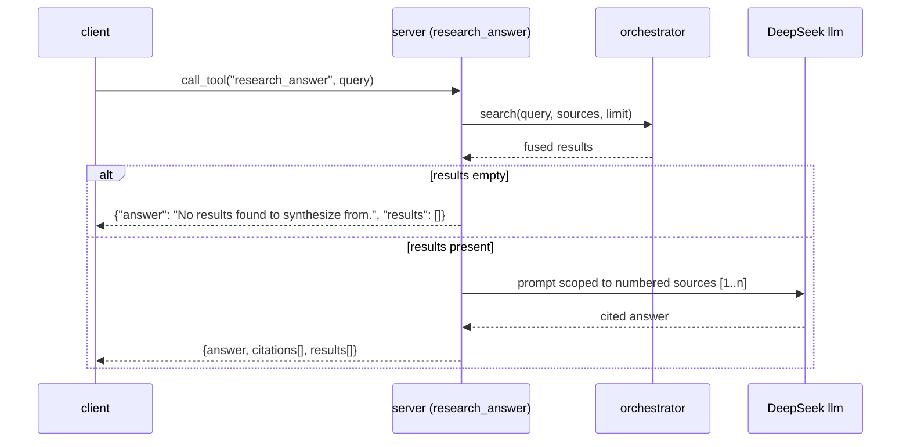

# MCP Tool Surface

The 14 MCP tools are the public API. Renaming a tool, removing one, or changing
a return field is a **major** version bump (`docs/architecture.md`). Two tests
hold this surface: `tests/test_contract.py` asserts 18 sources + 14 tools +
`Result` shape against the live `tools/list`, and `tests/test_mcp_handshake.py`
proves the bare `search-gateway` command serves it over stdio.

## Search

### `search(query, sources?, category, limit, freshness?)`

Unified fan-out + fuse + re-rank + diversity. Each result is a `Result` dict.

| Arg | Type | Default | Notes |
|-----|------|---------|-------|
| `query` | str | — | required |
| `sources` | list[str]? | fast set | subset of `[searxng, exa, github, youtube, bilibili, v2ex, twitter, reddit, facebook, instagram, linkedin]` |
| `category` | str | `general` | `general` \| `news` \| `science` \| `social media` |
| `limit` | int | 10 | clamped 1..30 |
| `freshness` | str? | — | `day` \| `week` \| `month` \| `year` |

Returns `{count, results[], sources{}}`.

### `search_web(query, limit?, freshness?)`
SearXNG metasearch + Exa neural search. Returns `{count, results[], sources{}}`.

### `search_news(query, limit?)`
SearXNG news engines + Exa. Returns `{count, results[], sources{}}`.

### `search_science(query, limit?, year_from?, open_access_only?)`
Academic sources (arXiv + OpenAlex + Crossref) + SearXNG science fallback.

### `search_academic(query, limit?, year_from?, open_access_only?)`
arXiv + OpenAlex + Crossref only. Results carry `doi`/`arxiv_id`/`authors`/
`year`/`venue`/`citation_count`/`is_oa` in `meta`.

### `search_social(query, limit?)`
Twitter/X + Reddit + Facebook + Instagram. Query expansion is disabled here —
it would run against SearXNG+Exa and pollute a social-only result set when the
browser-backed sources time out. Social results stay social.

## Scholarly

### `get_paper(identifier)`
Resolve a DOI / arXiv ID / title → merged Crossref + OpenAlex + arXiv record.

### `get_citations(identifier, limit=20)`
Papers citing a given identifier (OpenAlex, Semantic Scholar fallback).

### `get_references(identifier, limit=20)`
A paper's reference list (Crossref full refs, OpenAlex fallback).

## Synthesis / utility

### `research_answer(query, sources?, limit=8)`

Search, then synthesize a cited answer with DeepSeek. The prompt is scoped
"use ONLY the numbered sources"; if the sources don't answer the question, the
synthesis says so rather than guessing. Returns `{answer, citations[], results[]}`.

### `read_url(url)`
Read a web page as Markdown (Jina Reader). Returns `{url, content, length}`.

### `doctor()`
Health report: Redis, models, every source, academic latency/rate-limit status,
and ledger health. 18 sources + `redis`/`rerank`/`embed`/`llm`/`ledger` keys.
Shared with the CLI via `health.report()` — `search-gateway doctor` prints the
same JSON.

### `stats_report()`
Per-source reliability & latency (rolling 24h) + ledger health.

### `saved_queries(action, name?, query?, sources?, freshness?, category?, limit=10)`

Manage recurring queries (Redis-backed). `action`: `save` \| `list` \| `delete`
\| `run` \| `diff` (returns `{new, removed, unchanged}`). This tool is verified
end-to-end over MCP (`tests/test_mcp_handshake.py`) — a regression guard for
the module/function name-shadowing bug that previously crashed it.
