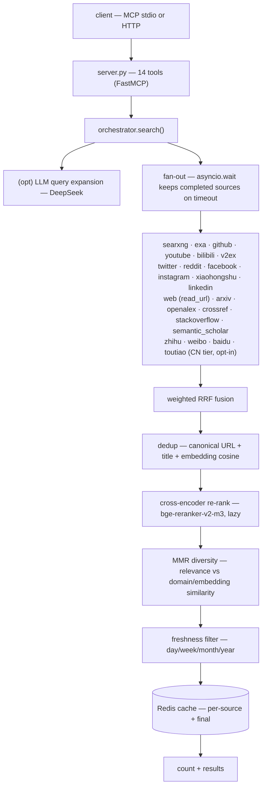
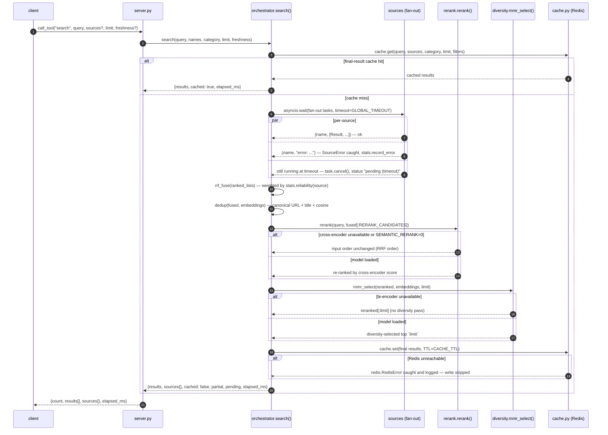
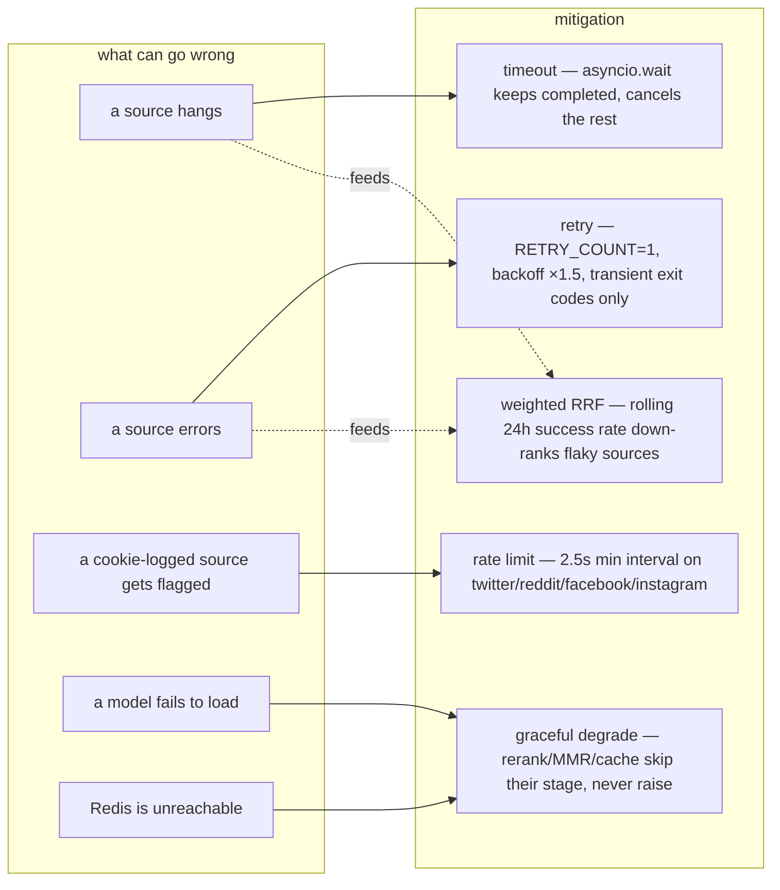
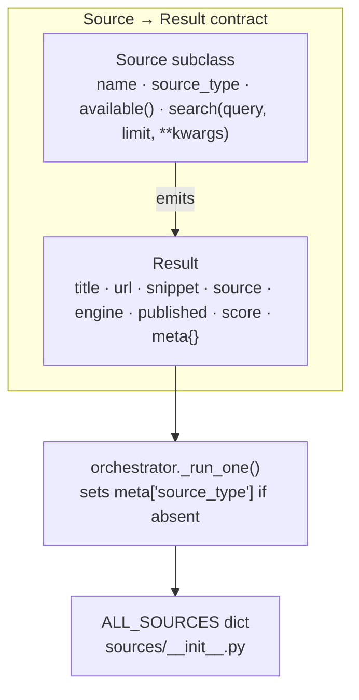
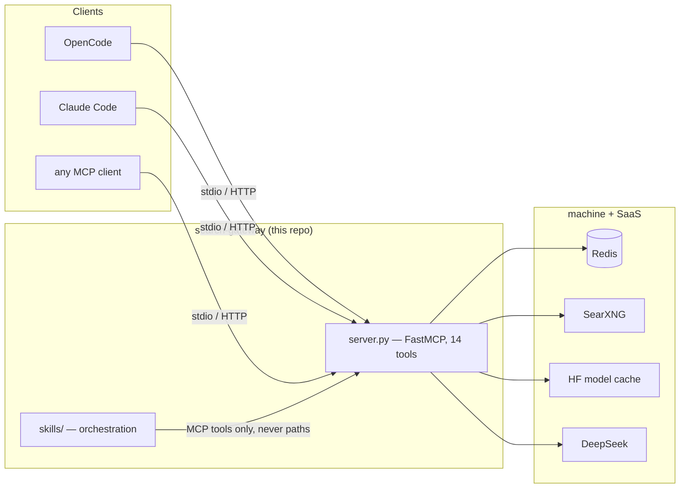

# Architecture

The gateway's entire design bet is this: **the conformance check is the
protocol handshake, so no client is the source of truth.** OpenCode, Claude
Code, or a bespoke script all see the same 14 tools — because they all speak
MCP to the same server, and the server does not know any of them exist. This
document is the map of that bet: how a search flows through the pipeline,
what each module owns, how the system behaves when a piece of it fails, how
to extend it with a new source, and where the decoupling boundary actually
lives.

## The pipeline

The pipeline is a sequence of independent stages, each with a single
responsibility and a lazy, graceful fallback. A source that fails on timeout
does not fail the search — `asyncio.wait` keeps whatever completed. A model
that cannot load does not crash the request — re-rank and MMR degrade to
their inputs. That resilience is the reason the server can be a local host
process on a 16 GB CPU box and still feel reliable.

## Request lifecycle

The pipeline diagram shows the stages; this shows the actual sequence of
calls for one `search`, including the two branches that matter most in
production: a source timing out mid-fan-out, and a downstream dependency
(model or Redis) being unavailable.

Three invariants fall out of this diagram directly. A pending source never
raises — it is cancelled and reported, not retried mid-request (retries
happen inside `_run_one`, before the fan-out timeout, not after). A rerank or
embedding failure narrows the pipeline to its previous stage's output rather
than raising — `rerank()` and `mmr_select()` both have an explicit "model is
None" branch that returns the input unchanged. And a Redis outage costs you
the cache, nothing more — every `cache.py` and `stats.py` call is wrapped in
`except redis.RedisError`, logged at `debug`, and treated as a miss.

## Reliability model

Resilience here is not one big try/except — it's five independent
mechanisms, each covering a different failure mode.

**Retry.** `SEARCH_GATEWAY_RETRY_COUNT=1` with `SEARCH_GATEWAY_RETRY_BACKOFF=1.5`
(seconds, doubling per retry) applies to transient, curl-style exit codes
(`RETRYABLE_EXIT_CODES = (1, 8, 52, 56)` in `config.py`) — an auth failure or a
404 is not retried, since retrying won't fix it.

**Rate limiting on cookie-logged sources.** `twitter`, `reddit`, `facebook`,
and `instagram` (`RATE_LIMITED_SOURCES`) share a minimum 2.5-second interval
between queries (`SEARCH_GATEWAY_RATE_LIMIT`), enforced in `ratelimit.py` via
a Redis `SET NX EX` gate with an in-memory fallback — the mechanism exists
because these sources authenticate with browser cookies, and burst traffic
risks the account, not just a 429.

**Two-tier fan-out + opencli serialization.** Fast, non-browser sources
(`searxng`, `exa`, `github`, `youtube`, `bilibili`, `v2ex`) are the default
fan-out; browser-backed social sources are opt-in via `sources=` because they
route through one shared Chromium bridge (`SEARCH_GATEWAY_OPENCLI_PROFILES=1`
profile by default) — running them by default would serialize every default
search behind a single browser session.

**Cache TTLs.** Per-source results cache for 15 minutes
(`SEARCH_GATEWAY_SOURCE_CACHE_TTL=900`); the final fused-and-reranked result
caches for 1 hour (`SEARCH_GATEWAY_CACHE_TTL=3600`). The asymmetry is
deliberate: a per-source result is reusable across many different final
queries (different `limit`, different fused neighbors), so it earns a shorter,
more frequently-refreshed TTL, while the expensive fused+reranked output is
worth caching longer.

**Why flaky sources self-down-rank.** `fusion.py`'s weighted RRF multiplies
each source's rank-based score by `stats.reliability(source)` — the rolling
24-hour success rate from `stats.py`, floored at `0.05` so a source is never
fully zeroed out. A source with a 60% success rate over the last day
contributes roughly 60% of the RRF weight it would at 100%, on every query,
automatically — no manual downgrade, no alerting rule required
(`docs/adrs/0003-weighted-rrf.md`).

## Source-adapter contract

Every source subclasses `Source` and returns a list of `Result` objects — that
one contract is what lets fusion, dedup, rerank, and MMR treat 18 wildly
different backends identically.

To add source #19:

1. Subclass `Source` in a new `sources/<name>.py`, implementing `search()`
   (and `available()` for the `doctor` health probe).
2. Emit `Result` objects — `title`, `url` at minimum; populate `meta` keys per
   `docs/meta-schema.md` (`source_type`, and whichever bibliographic/engagement
   keys apply).
3. Register the instance in `ALL_SOURCES` in `sources/__init__.py` — this is
   the single source of truth the orchestrator, `doctor`, and `search-gateway
   check` all read from.
4. Update `tests/test_contract.py`'s expected source count (18 → 19) and add
   coverage — the test asserts the live `tools/list`/source registry, so an
   unregistered or miscounted source fails CI immediately, not at review time.

Nothing else needs to change. Fusion, dedup, rerank, and MMR are written
against `Result`, not against any individual source's shape.

## Modules

| Module | Responsibility |
|--------|----------------|
| `server.py` | 14 MCP tools + `main(transport, …)` |
| `cli.py` | console entry point (`serve/doctor/check/version/warm`) |
| `health.py` | `report()` / `check()` shared by the `doctor` tool + CLI |
| `log.py` | structured logging (text/json → stderr) |
| `orchestrator.py` | fan-out + fuse + re-rank + diversity pipeline |
| `sources/` | 23 source adapters, all subclassing `Source` → `Result` |
| `extract/` | v0.4 extraction layer: tier routing, block detection, browser budget/pacing, profile farm, fingerprints, env-gated proxies, HTTP impersonation, multi-shape parsing, Camoufox adapter |
| `models.py` | `Result` dataclass (the universal contract) |
| `fusion.py` | weighted RRF |
| `dedup.py` / `diversity.py` | canonical + embedding dedup, MMR |
| `rerank.py` / `embeddings.py` | lazy cross-encoder / bi-encoder (pinned revisions) |
| `llm.py` | DeepSeek client (OpenAI-compatible) |
| `cache.py` / `stats.py` / `ratelimit.py` | Redis cache, reliability stats, rate limiting |
| `saved_queries.py` | recurring queries (Redis-backed) |
| `config.py` | env-overridable configuration |

## The decoupling boundary

The boundary holds by four invariants:

- **Client-agnostic transport.** stdio by default; `http`/`sse` for a
  long-running host process. The `initialize`/`tools/list` handshake is the
  conformance check — verify it with a raw client, not a client's config.
- **Skills talk to the gateway only over MCP tools**, never by path. The
  orchestration skills in `skills/` are versioned here and symlinked into the
  client's skill dir by `install.sh`; the gateway never reads them.
- **Everything machine-specific is an env override.** No hardcoded
  `~/.config/opencode/...` path survives in code; Redis, SearXNG, and secrets
  all arrive via environment variables (`docs/config-reference.md`).
- **`Result` is the universal contract.** All 23 sources emit it; fusion,
  re-rank, dedup, and the report skills consume it. Any tool-surface or
  `meta` change is therefore a SemVer-major event.

## Design decisions

Six standing decisions, kept as short ADRs rather than folded into prose,
because each is a decision someone could plausibly revisit — the ADR is the
record of why it was made the way it was.

| ADR | Decision |
|-----|----------|
| [`0001-stdio-first.md`](adrs/0001-stdio-first.md) | stdio is the default transport; `http`/`sse` are opt-in for a host process; the handshake, not any client, is the conformance check |
| [`0002-host-process-redis-state.md`](adrs/0002-host-process-redis-state.md) | the gateway stays a host process (CLIs + Chromium + warm model cache don't dockerize); Redis owns cache/stats/rate-limit/saved queries, with AOF for persistence |
| [`0003-weighted-rrf.md`](adrs/0003-weighted-rrf.md) | fusion weight is each source's rolling 24h success rate — flaky sources self-down-rank without manual intervention |
| [`0004-cross-encoder-bi-encoder-cjk.md`](adrs/0004-cross-encoder-bi-encoder-cjk.md) | the re-ranker is a cross-encoder (bge-reranker-v2-m3); a MiniLM bi-encoder handles dedup/MMR; a lazy multilingual bi-encoder (bge-m3) loads only for CJK-dominant runs |
| [`0005-pinned-model-revisions.md`](adrs/0005-pinned-model-revisions.md) | `*_REVISION` env vars pin Hugging Face commit SHAs to stop commit-churn re-downloads |
| [`0006-skills-in-repo-submodule.md`](adrs/0006-skills-in-repo-submodule.md) | orchestration skills ship in-repo and symlink-install; `diagram-design` arrives as a git submodule |

## Versioning

SemVer from `search_gateway/__init__.py`. Adding a tool is a minor bump;
removing or renaming a tool, or changing a `Result`/return field, is major, with
a deprecation cycle. `docs/api/tools.md` + `docs/meta-schema.md` are the
canonical contract, matched against the live `tools/list` by
`tests/test_contract.py`.