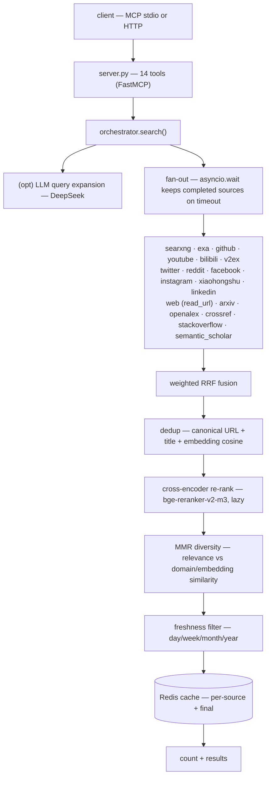
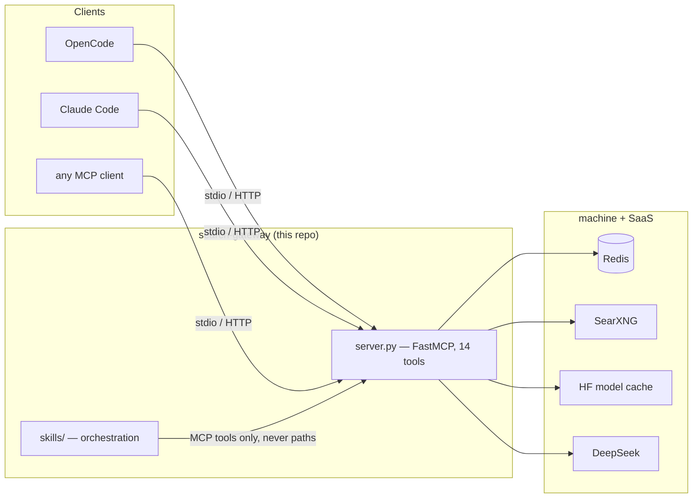

# Architecture

The gateway's entire design bet is this: **the conformance check is the
protocol handshake, so no client is the source of truth.** OpenCode, Claude
Code, or a bespoke script all see the same 14 tools — because they all speak
MCP to the same server, and the server does not know any of them exist. This
document is the map of that bet: how a search flows through the pipeline, what
each module owns, and where the decoupling boundary actually lives.

## The pipeline

The pipeline is a sequence of independent stages, each with a single
responsibility and a lazy, graceful fallback. A source that fails on timeout
does not fail the search — `asyncio.wait` keeps whatever completed. A model
that cannot load does not crash the request — re-rank and MMR degrade to their
inputs. That resilience is the reason the server can be a local host process
on a 16 GB CPU box and still feel reliable.

## Modules

| Module | Responsibility |
|--------|----------------|
| `server.py` | 14 MCP tools + `main(transport, …)` |
| `cli.py` | console entry point (`serve/doctor/check/version/warm`) |
| `health.py` | `report()` / `check()` shared by the `doctor` tool + CLI |
| `log.py` | structured logging (text/json → stderr) |
| `orchestrator.py` | fan-out + fuse + re-rank + diversity pipeline |
| `sources/` | 18 source adapters, all subclassing `Source` → `Result` |
| `models.py` | `Result` dataclass (the universal contract) |
| `fusion.py` | weighted RRF |
| `dedup.py` / `diversity.py` | canonical + embedding dedup, MMR |
| `rerank.py` / `embeddings.py` | lazy cross-encoder / bi-encoder (pinned revisions) |
| `llm.py` | DeepSeek client (OpenAI-compatible) |
| `cache.py` / `stats.py` / `ratelimit.py` | Redis cache, reliability stats, rate limiting |
| `saved_queries.py` | recurring queries (Redis-backed) |
| `config.py` | env-overridable configuration |

## The decoupling boundary

The boundary holds by four invariants:

- **Client-agnostic transport.** stdio by default; `http`/`sse` for a
  long-running host process. The `initialize`/`tools/list` handshake is the
  conformance check — verify it with a raw client, not a client's config.
- **Skills talk to the gateway only over MCP tools**, never by path. The
  orchestration skills in `skills/` are versioned here and symlinked into the
  client's skill dir by `install.sh`; the gateway never reads them.
- **Everything machine-specific is an env override.** No hardcoded
  `~/.config/opencode/...` path survives in code; Redis, SearXNG, and secrets
  all arrive via environment variables (`docs/config-reference.md`).
- **`Result` is the universal contract.** All 18 sources emit it; fusion,
  re-rank, dedup, and the report skills consume it. Any tool-surface or
  `meta` change is therefore a SemVer-major event.

## Versioning

SemVer from `search_gateway/__init__.py`. Adding a tool is a minor bump;
removing or renaming a tool, or changing a `Result`/return field, is major, with
a deprecation cycle. `docs/api/tools.md` + `docs/meta-schema.md` are the
canonical contract, matched against the live `tools/list` by
`tests/test_contract.py`.
