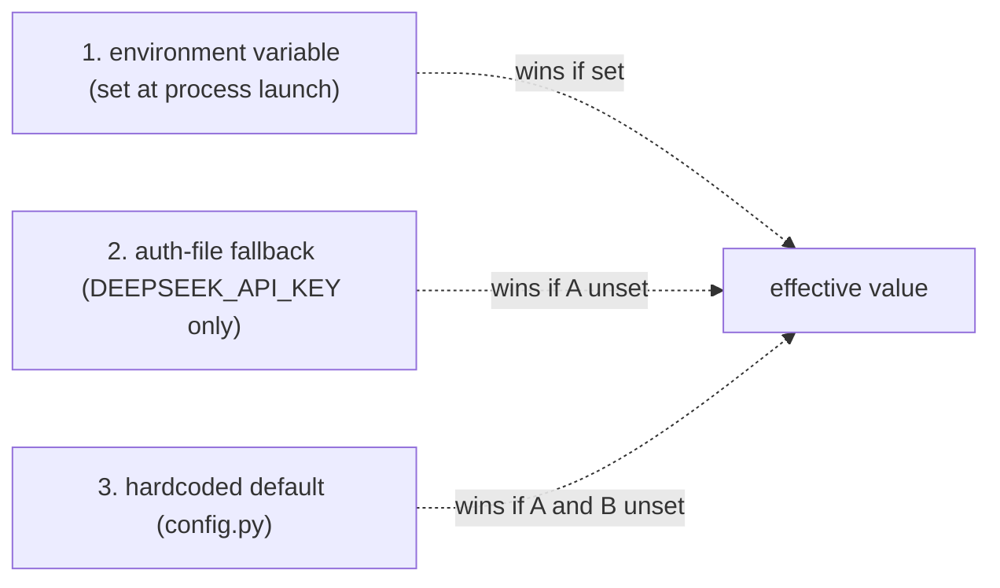

# Configuration Reference

All 82 settings are environment variables with defaults — `config.py` is the
source of truth, and `.env.example` mirrors it (verified: the three cross-check
clean against each other). Copy `.env.example`, override what you need, and
never commit a secret (`.gitignore` blocks `*.env`).

One invariant, restated because it matters: **logs go to stderr — stdout is the
MCP stdio protocol wire.** `KORTEX_SEARCH_LOG_FMT=json` emits one JSON object
per line to stderr for systemd/journald.

## Override precedence

For every setting, resolution happens in this order, highest wins:

Almost every variable is `env var > default` — two levels, checked by
`_env`/`_env_bool`/`_env_int`/`_env_float` in `config.py`. Exactly one setting
has a third level: `DEEPSEEK_API_KEY`. `llm.get_api_key()` reads the env var
first and, only if that's empty, falls back to `load_env_file(DEEPSEEK_AUTH_FILE,
...)` — so a value exported in the shell always overrides whatever sits in
`~/.agent-reach/deepseek.env`. `TWITTER_AUTH_FILE` is different: it only sets
*where* Twitter reads its tokens from — the tokens themselves
(`TWITTER_AUTH_TOKEN` / `TWITTER_CT0`) come from that file and have no env-var
override. Every other variable — `SEARXNG_BASE`, all the fusion/rerank knobs,
the cache TTLs — has no file-based fallback; if the env var isn't set, you get
the hardcoded default, full stop.

## Rationale by group + tier mapping

Each group below exists to solve one operational problem, and each maps to a
point in the capability-tier ladder from `docs/deployment.md` — most vars
matter starting at a specific tier, not from `minimal` onward.

| Group | Solves | Matters starting at tier |
|-------|--------|---------------------------|
| Infrastructure | Where Redis/SearXNG live; GitHub rate-limit relief | **minimal** |
| Search behaviour | Fan-out budget and the polite-pool contact email | **minimal** |
| Retry | Distinguishing a transient failure from a permanent one | **minimal** |
| Rate limiting | Protecting cookie-authenticated accounts from bans | **social/vertical** |
| Fusion / re-rank / diversity | Turning 18 raw result lists into one ranked, deduped, diverse list | **web+neural** (rerank/embed models apply to any multi-source fan-out) |
| Pinned model revisions | Stopping silent re-downloads when a model repo's HEAD moves | **web+neural** |
| Two-tier / opencli parallelism | Isolating slow, browser-backed sources from the fast default fan-out | **social/vertical** |
| Cache | Bounding repeat-query cost and staleness | **minimal** |
| LLM / answer synthesis | `research_answer` + query expansion | **answer synthesis** |
| Auth files | Keeping tokens out of shell history and process listings | **social/vertical**, **answer synthesis** |
| Observability / serving | Log format/level; HTTP bind address for a host-process deployment | **minimal** (logging), **any tier running `--transport http/sse`** (host/port) |
| Ledger health | Read-only visibility into `deep-research` skill run health | optional, any tier |
| Extraction tiering (v0.4) | Browser budget, jittered pacing, per-profile health | **social/vertical** |
| Block intelligence (v0.4) | Detecting challenge walls instead of burning retries on them | **social/vertical** |
| Proxy subsystem (v0.4) | Optional residential/ISP egress with geo-coherent fingerprints | only when funded (see `docs/extraction/proxy-funding-guide.md`) |
| Stealth / impersonation (v0.4) | Camoufox anonymous tier + curl_cffi TLS impersonation | experimental, opt-in |
| Read_url stages (v0.4) | Jina → Trafilatura → readability extraction pipeline | **minimal** |
| CN tier (v0.4) | zhihu/weibo/baidu/toutiao + bilibili wbi signing | opt-in (`KORTEX_SEARCH_CN_SOURCES=1`) |
| Containment (v0.4.1+) | L1 egress floor (SSRF/metadata), L2 forced-proxy, L3 kernel filter, per-persona secrets vault, block telemetry | **any tier** (floor), **social/vertical** (L2/L3/vault/telemetry) |

## Infrastructure

*Where the gateway's two hard service dependencies live, plus an optional
GitHub token.*

| Variable | Default | Purpose |
|----------|---------|---------|
| `SEARXNG_BASE` | `http://127.0.0.1:8888` | SearXNG metasearch endpoint (JSON API) |
| `KORTEX_SEARCH_REDIS_URL` | `redis://127.0.0.1:6379/0` | cache + stats + rate-limit + saved queries |
| `GITHUB_TOKEN` | `""` | GitHub REST rate-limit boost (optional) |

## Search behaviour

*The fan-out budget and the one non-secret "identity" var — a courtesy email
some academic APIs ask for, not an API key.*

| Variable | Default | Purpose |
|----------|---------|---------|
| `KORTEX_SEARCH_MAILTO` | `kaichen.research@proton.me` | polite-pool email for OpenAlex/Crossref (not a key) |
| `KORTEX_SEARCH_TIMEOUT` | `50` | global fan-out budget (seconds per search) |
| `KORTEX_SEARCH_TOTAL_TIMEOUT` | `45` | end-to-end budget per search tool call (fan-out + expansion + CPU legs must fit the client's request budget) |
| `KORTEX_SEARCH_EXPANSION_LLM_TIMEOUT` | `12` | expansion LLM leg budget; slow completion degrades to "no variants" |
| `KORTEX_SEARCH_ANSWER_LLM_TIMEOUT` | `25` | `research_answer` synthesis leg budget; slow completion degrades to an explicit timeout answer |
| `KORTEX_SEARCH_SOURCE_TIMEOUT` | `18` | per-source timeout (seconds) |

`KORTEX_SEARCH_TIMEOUT=50` bounds the whole fan-out in seconds (`config.py`).
Lower it when sources hang; raise it for slow verticals.

## Retry

*How many times, and how long to wait, before giving up on one source for one
query — scoped to transient failures only.*

| Variable | Default | Purpose |
|----------|---------|---------|
| `KORTEX_SEARCH_RETRY_COUNT` | `1` | retries per source |
| `KORTEX_SEARCH_RETRY_BACKOFF` | `1.5` | backoff multiplier (×2 per retry) |

Retries apply only to `RETRYABLE_EXIT_CODES = (1, 8, 52, 56)` — curl-style
transient codes. An auth failure or a 404 is not retried; retrying a
permanent failure just burns the fan-out budget.

## Rate limiting (cookie-logged sources)

*A floor on request frequency to the four cookie-authenticated sources, so
burst traffic doesn't read as bot behavior to the platform.*

| Variable | Default | Purpose |
|----------|---------|---------|
| `KORTEX_SEARCH_RATE_LIMIT` | `2.5` | min seconds between queries to cookie-logged sources |

Applies to `RATE_LIMITED_SOURCES = {twitter, reddit, facebook, instagram}`
specifically — the four other social/video sources (xiaohongshu, linkedin,
youtube, bilibili) authenticate differently and aren't gated by this variable.

## Fusion / re-rank / diversity

*The knobs that turn 18 raw ranked lists into one fused, deduped, re-ranked,
diverse list.*

| Variable | Default | Purpose |
|----------|---------|---------|
| `KORTEX_SEARCH_RERANK_MODEL` | `BAAI/bge-reranker-v2-m3` | cross-encoder for re-rank |
| `KORTEX_SEARCH_EMBED_MODEL` | `sentence-transformers/all-MiniLM-L6-v2` | bi-encoder (dedup/MMR) |
| `KORTEX_SEARCH_EMBED_MODEL_CJK` | `BAAI/bge-m3` | multilingual bi-encoder for CJK-heavy runs (lazy) |
| `KORTEX_SEARCH_EMBED_CJK` | `1` | enable/disable the CJK-dominant detection + multilingual model switch |
| `KORTEX_SEARCH_CJK_SHARE_THRESHOLD` | `0.25` | CJK char share that triggers the multilingual model |
| `SEMANTIC_RERANK` | `1` | `0` = RRF-only |
| `KORTEX_SEARCH_RERANK_CANDIDATES` | `30` | top-RRF candidates re-ranked |
| `KORTEX_SEARCH_MMR` | `1` | diversity filter |
| `KORTEX_SEARCH_MMR_LAMBDA` | `0.75` | relevance vs diversity trade-off |
| `KORTEX_SEARCH_EMBEDDING_DEDUP` | `1` | embedding near-dup collapse |
| `KORTEX_SEARCH_WEIGHTED_RRF` | `1` | reliability-weighted fusion |
| `KORTEX_SEARCH_FRESHNESS` | `1` | freshness filter |

`KORTEX_SEARCH_MMR_LAMBDA=0.75` weighs relevance 75% against diversity 25% in
the greedy MMR selection (`diversity.py`) — raise it toward `1.0` if results
feel too scattered across unrelated domains, lower it if the top-k feels like
five copies of the same article.
`KORTEX_SEARCH_EMBED_CJK` is the master switch: with it off, `cjk_dominant()`
always returns `False` and the multilingual model never loads, regardless of
how much Chinese/Japanese/Korean text is in the fused set.

## Pinned model revisions

Empty string = unpinned. Pinned by default so Hugging Face commit-churn never
triggers a silent re-download (verified: models load from cache with the pinned
`revision=`).

| Variable | Default (sha) |
|----------|---------------|
| `KORTEX_SEARCH_RERANK_REVISION` | `953dc6f6f85a1b2dbfca4c34a2796e7dde08d41e` |
| `KORTEX_SEARCH_EMBED_REVISION` | `1110a243fdf4706b3f48f1d95db1a4f5529b4d41` |
| `KORTEX_SEARCH_EMBED_CJK_REVISION` | `5617a9f61b028005a4858fdac845db406aefb181` |

`docs/adrs/0005-pinned-model-revisions.md` has the incident this fixed.

## Inference backend

*The cross-encoder runs on ONNX Runtime by default — ~2× faster re-rank and a
smaller memory footprint than torch, at essentially equal ranking quality
(Spearman ≈ 0.96). `optimum` + `onnxruntime` are core dependencies.*

| Variable | Default | Purpose |
|----------|---------|---------|
| `KORTEX_SEARCH_INFERENCE_BACKEND` | `onnx_int8` | `onnx_int8` (dynamic-quantized) \| `onnx` (fp32) \| `torch` |
| `KORTEX_SEARCH_RERANK_ONNX_MODEL` | `onnx-community/bge-reranker-v2-m3-ONNX` | pre-exported ONNX cross-encoder |
| `KORTEX_SEARCH_RERANK_ONNX_REVISION` | `6f5ff65…` | pinned revision of the ONNX model |

`onnx` selects `model.onnx` (fp32); `onnx_int8` selects `model_int8.onnx`.
Set `KORTEX_SEARCH_INFERENCE_BACKEND=torch` to use the original
`BAAI/bge-reranker-v2-m3` weights via `sentence-transformers`. If the ONNX
model can't load (not yet cached, offline), the reranker falls back to torch
automatically rather than silently dropping re-rank.

## Two-tier / opencli parallelism

*Isolating the slow, browser-backed sources so they don't block the fast
default fan-out.*

| Variable | Default | Purpose |
|----------|---------|---------|
| `KORTEX_SEARCH_TWO_TIER` | `1` | two-tier fan-out for slow sources |
| `KORTEX_SEARCH_OPENCLI_PROFILES` | `1` | number of Chromium profiles (parallel opencli bridge) |

## Cache

*How long a result is trusted before the gateway re-fetches it.*

| Variable | Default | Purpose |
|----------|---------|---------|
| `KORTEX_SEARCH_CACHE_TTL` | `3600` | final-result TTL (seconds) |
| `KORTEX_SEARCH_SOURCE_CACHE_TTL` | `900` | per-source TTL (seconds) |

The final-result TTL outlives the per-source TTL by 4×: a per-source result
is reusable across many different fused queries, so it refreshes more often;
the expensive fused-and-reranked output is worth holding onto longer.

## LLM / answer synthesis

*Everything `research_answer` and query expansion need — and nothing else
needs.*

| Variable | Default | Purpose |
|----------|---------|---------|
| `KORTEX_SEARCH_QUERY_EXPANSION` | `1` | LLM query variants |
| `KORTEX_SEARCH_LLM` | `1` | enable LLM features |
| `KORTEX_SEARCH_LLM_MODEL` | `deepseek-v4-flash` | reasoning LLM |
| `KORTEX_SEARCH_LLM_TIMEOUT` | `60` | LLM request timeout (seconds) |
| `DEEPSEEK_API_KEY` | `""` | DeepSeek key (also read from `DEEPSEEK_AUTH_FILE`) |
| `DEEPSEEK_BASE_URL` | `https://api.deepseek.com` | DeepSeek API base URL |

Every other tool works with none of these set. `search`, `search_web`,
`search_academic`, and the rest never touch DeepSeek; only `research_answer`'s
synthesis step and the optional query-expansion pass inside `orchestrator.py`
do (`docs/faq.md`).

## Auth files (paths, not inline secrets)

| Variable | Default |
|----------|---------|
| `KORTEX_SEARCH_PERSONA` | `kaiser` |
| `KORTEX_SEARCH_VAULT_DIR` | `~/.agent-reach/profiles` |
| `KORTEX_SEARCH_CREDENTIALS_DIR` | `""` |
| `TWITTER_AUTH_FILE` | `~/.agent-reach/profiles/kaiser/twitter.env` |
| `DEEPSEEK_AUTH_FILE` | `~/.agent-reach/profiles/kaiser/deepseek.env` |
| `KORTEX_SEARCH_PROXY_AUTH_FILE` | `~/.agent-reach/profiles/kaiser/proxy.env` |

These are *paths* to files containing `KEY=VALUE` secrets, parsed by
`load_env_file()` (export-aware, quote-stripped) — not secrets themselves.
Since 0.4.1 the defaults live in the **per-persona vault** (0600, decision
D7.3). Resolution chain per secret kind: `KORTEX_SEARCH_CREDENTIALS_DIR`
(systemd `$CREDENTIALS_DIRECTORY` bridge — files arrive via `LoadCredential=`,
never env vars) → the configured vault path. The legacy flat paths
(`~/.agent-reach/<name>.env`) were honored through 0.4.2 and **removed in
0.4.3** — migrate with `kortex-search vault migrate` before upgrading past
0.4.2; inspect with `vault status`.

## Observability / serving

| Variable | Default | Purpose |
|----------|---------|---------|
| `KORTEX_SEARCH_LOG_FMT` | `text` | `text` \| `json` (JSON → stderr, one object/line) |
| `KORTEX_SEARCH_LOG_LEVEL` | `INFO` | Python log level |
| `KORTEX_SEARCH_HOST` | `127.0.0.1` | bind host for `serve --transport http/sse` |
| `KORTEX_SEARCH_PORT` | `8765` | bind port for `serve --transport http/sse` |

`KORTEX_SEARCH_HOST`/`_PORT` are read only when `--transport http` or
`--transport sse` is passed to `serve` — the stdio default (no flag) ignores
both.

## Ledger health

| Variable | Default | Purpose |
|----------|---------|---------|
| `KORTEX_SEARCH_LEDGER_DIR` | `~/research_runs` | dir scanned by `doctor`/`stats_report` for run health |

Read-only: `stats.ledger_health()` walks this directory for `ledger.json`
files and never writes to it. A missing directory or a malformed
`ledger.json` is skipped, not raised.

> Logs always go to **stderr** — stdout is the MCP stdio protocol wire.

---

## v0.4 extraction layer (Project Gatekeeper)

*Everything the extraction overhaul added. Risky capabilities ship disabled;
the gateway's behavior is unchanged when the flags below sit at their
defaults. Full rationale: `docs/extraction/LESSONS.md`.*

### Browser budget & pacing

| Variable | Default | Purpose |
|----------|---------|---------|
| `KORTEX_SEARCH_BROWSER_BUDGET` | `1` | concurrent browser ops (1 = old single-bridge behavior; raise per profile farm) |
| `KORTEX_SEARCH_RATE_LIMIT_JITTER` | `0.3` | ± fraction of the inter-query interval — fixed intervals are a fingerprint |
| `KORTEX_SEARCH_PROFILE_DIR` | `~/.agent-reach/profiles` | JSON profile definitions for the browser farm |
| `KORTEX_SEARCH_PROFILE_HEALTH_TTL` | `3600` | base cooldown TTL for profile health transitions (seconds) |

### Block & challenge intelligence

| Variable | Default | Purpose |
|----------|---------|---------|
| `KORTEX_SEARCH_BLOCK_DETECTION` | `1` | classify CLI/HTTP outputs for challenge markers; blocked → fail immediately, never retry |
| `KORTEX_SEARCH_PLATFORM_BLOCK_LIMIT` | `3` | failures before a profile enters cooldown; N cooldown cycles → quarantine |
| `KORTEX_SEARCH_PLATFORM_COOLDOWN_TTL` | `900` | per-platform circuit-breaker pause (seconds) |

### Stealth & impersonation (experimental, default OFF)

| Variable | Default | Purpose |
|----------|---------|---------|
| `KORTEX_SEARCH_STEALTH` | `0` | enable the Camoufox anonymous tier (`docs/extraction/stealth-matrix.md`) |
| `KORTEX_SEARCH_STEALTH_PROFILE` | `""` | pinned Camoufox fingerprint preset (empty = random browserforge) |
| `KORTEX_SEARCH_IMPERSONATE` | `0` | curl_cffi TLS/JA3 impersonation for bilibili/zhihu/weibo HTTP |

### Proxy subsystem (default OFF)

| Variable | Default | Purpose |
|----------|---------|---------|
| `KORTEX_SEARCH_PROXY_ENABLED` | `0` | master switch (`docs/extraction/proxy-funding-guide.md`) |
| `KORTEX_SEARCH_PROXY_PROTOCOL` | `http` | `http` \| `socks5` |
| `KORTEX_SEARCH_PROXY_GATEWAY` | `""` | provider gateway `host:port` |
| `KORTEX_SEARCH_PROXY_USERNAME` | `""` | targeting-grammar username (verbatim wins; else auto-built `country-sid-ttl`) |
| `KORTEX_SEARCH_PROXY_PASSWORD` | `""` | provider password |
| `KORTEX_SEARCH_PROXY_COUNTRY` | `""` | persona egress country (ISO) |
| `KORTEX_SEARCH_PROXY_STICKY_TTL` | `30m` | sticky-session lifetime per profile |
| `KORTEX_SEARCH_PROXY_GEO_ALIGN` | `1` | derive TZ/locale/languages from egress geo into the fingerprint bundle |

### read_url stages

| Variable | Default | Purpose |
|----------|---------|---------|
| `KORTEX_SEARCH_READ_URL_STAGES` | `jina,trafilatura,readability` | stage order; first to return ≥50 chars wins |
| `KORTEX_SEARCH_TRAFILATURA_MIN_LEN` | `300` | minimum usable length for the trafilatura stage |
| `KORTEX_SEARCH_LLM_PARSE` | `0` | gated LLM-assisted extraction for degenerate parse shapes (validated) |

### CN tier (opt-in)

| Variable | Default | Purpose |
|----------|---------|---------|
| `KORTEX_SEARCH_CN_SOURCES` | `0` | register-visible zhihu/weibo/baidu/toutiao become queryable |
| `ZHIHU_COOKIE` | `""` | `d_c0` + `z_c0` from a browser session (zhihu blocks anonymous, 401) |
| `WEIBO_SUB` | `""` | logged-in `SUB` cookie (weibo keyword search; hot list works without) |
| `KORTEX_SEARCH_BILIBILI_WBI` | `1` | wbi signing for bilibili (always on; keys Redis-cached) |
| `KORTEX_SEARCH_BILIBILI_WBI_KEY_TTL` | `82800` | wbi key cache TTL (23h — keys rotate daily) |

The CN tier's anonymous members: **baidu** + **toutiao** hot boards and
**zhihu_hot** (the zero-cookie hot list, R11) work with no cookies at all;
**zhihu** search and **weibo** keyword search need `ZHIHU_COOKIE` / `WEIBO_SUB`.
| `KORTEX_SEARCH_YOUTUBE_PO_PLUGIN` | `""` | yt-dlp PO-token provider plugin (e.g. `bgutil-ytdlp-pot-provider`) |
| `KORTEX_SEARCH_YOUTUBE_PO_SERVER` | `http://127.0.0.1:4416` | PO-token HTTP server URL when a provider plugin needs one |

### Containment & observability (v0.4.1+, Phase 7)

*The always-blocked network floor, the L2/L3 egress layers, the secrets
vault, and block telemetry. Full rationale: `docs/security.md` + the
D7.x decisions in `docs/extraction/LESSONS.md`.*

| Variable | Default | Purpose |
|----------|---------|---------|
| `KORTEX_SEARCH_EGRESS_FLOOR` | `1` | L1 egress floor: private/link-local/metadata egress blocked pre-nav AND post-redirect (default ON by design) |
| `KORTEX_SEARCH_FLOOR_EXEMPT` | `""` | operator allowlist for the floor (comma-separated hostnames/IPs); the gateway's own loopback deps are always exempt |
| `KORTEX_SEARCH_BLOCK_RESERVOIR` | `120` | block-event reservoir size (recent denials kept, 24h TTL) |
| `KORTEX_SEARCH_EGRESS_PROXY` | `1` | L2 forced-proxy for the anonymous browser tier (loopback CONNECT; every target through the floor; chains the residential tier when enabled). Anonymous engines only (D7.2) |
| `KORTEX_SEARCH_HARDEN` | `required` | L3 kernel-filter enforcement: `required` (browser ops refuse with the explicit `egress-unhardened` message until `kortex-search harden --install --sudo`) \| `permissive` (explicit opt-out for sandboxed CI) (D7.1) |
| `KORTEX_SEARCH_HARDEN_SUDO` | `0` | auto-use `sudo` when loading the nft ruleset (root already: auto) |