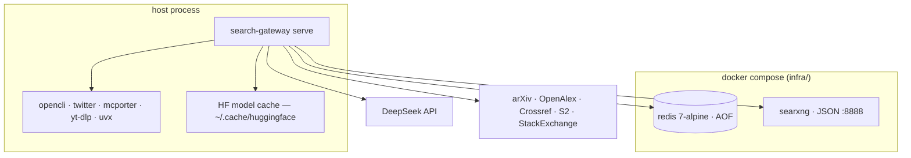

# Deployment

The gateway is a **host process**, not a container: it shells out to CLIs +
Chromium and uses a warm local Hugging Face model cache, so it does not
dockerize cleanly. Redis and SearXNG *do* dockerize. Deploy in capability tiers —
a fresh install degrades explicitly, and `search-gateway doctor` is the tier
report.



## Capability tiers

| Tier | Sources | Requires |
|------|---------|----------|
| **minimal** | arxiv, openalex, crossref, stackoverflow, github, web/`read_url` (+ searxng if up) | `pip install .` + network |
| **web+neural** | + exa | `mcporter` on PATH |
| **social/vertical** | + twitter, reddit, facebook, instagram, xiaohongshu, linkedin, youtube | `opencli`+Chromium, `twitter`, `yt-dlp`, `uvx` |
| **answer synthesis** | `research_answer`, query expansion | `DEEPSEEK_API_KEY` |

## 1. Native install

```bash
git clone <this-repo> && cd search-gateway
pip install .                  # or: pip install -e . for development
search-gateway --help
search-gateway check           # gate: 18 sources + Redis reachable
```

Optional report-tooling extras:

```bash
pip install '.[report]'        # matplotlib, weasyprint, python-docx, playwright
```

## 2. Services (Redis + SearXNG)

```bash
cd infra
docker compose up -d           # redis (AOF) + searxng (JSON, :8888)
search-gateway doctor          # both should report ok
```

Verified: `docker compose config` parses clean, and the searxng image mounts a
JSON-enabled `settings.yml`. Without Docker, run Redis and SearXNG natively and
point `SEARCH_GATEWAY_REDIS_URL` / `SEARXNG_BASE` at them.

## 3. Run as a host process

**stdio (default — client-spawned):** register the console script in your MCP
client (`docs/mcp-registration.md`); the client spawns `search-gateway` per
session.

**HTTP (long-running — systemd):**

```bash
mkdir -p ~/.config/search-gateway && touch ~/.config/search-gateway/gateway.env
chmod 600 ~/.config/search-gateway/gateway.env   # put DEEPSEEK_API_KEY etc. here
cp infra/systemd/search-gateway@.service ~/.config/systemd/user/
systemctl --user daemon-reload
systemctl --user enable --now search-gateway@8765.service
```

The unit runs `search-gateway check` before start (`ExecStartPre`), restarts on
failure, logs JSON to the journal, and keeps models warm across client
disconnects. `%i` is the HTTP port. Verified: `systemd-analyze verify` exits 0
on the shipped unit; the HTTP transport answers `tools/list` with 14 tools.

## 4. Headless tier-1 image (CI / academic-only)

```bash
docker build -f infra/Dockerfile -t search-gateway .
docker run --rm -p 8765:8765 search-gateway
```

No models, no browser CLIs — the "minimal" tier only. **Not yet validated:** the
GitHub-hosted CI run and the Docker image build (they run in CI on push; see
`.github/workflows/ci.yml`).

## 5. External dependencies (machine-level)

| Dep | Default | Override |
|-----|---------|----------|
| Redis | `redis://127.0.0.1:6379/0` | `SEARCH_GATEWAY_REDIS_URL` |
| SearXNG | `http://127.0.0.1:8888` | `SEARXNG_BASE` |
| DeepSeek | `https://api.deepseek.com` + key | `DEEPSEEK_API_KEY` / `DEEPSEEK_BASE_URL` |
| `opencli` + Chromium | social sources | `SEARCH_GATEWAY_OPENCLI_PROFILES` |
| `twitter` (twitter-cli) | twitter primary | — |
| `mcporter` | exa + linkedin | — |
| `yt-dlp` | youtube | — |
| `uvx` | linkedin | — |
| HF models (`~/.cache/huggingface`) | reranker · MiniLM · bge-m3 | model env vars + `*_REVISION` |
| arXiv / OpenAlex / Crossref / S2 / StackExchange | HTTP, no key | — |

`agent-reach` is a separate ecosystem: the gateway shells out to its CLIs but
does not bundle it.
