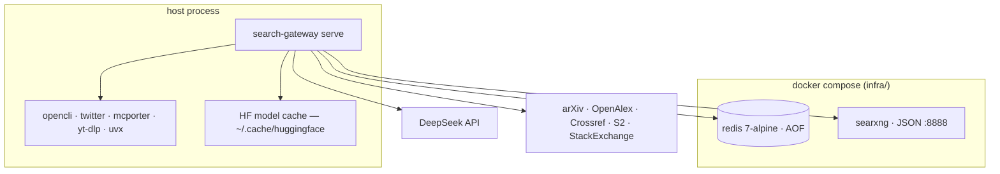
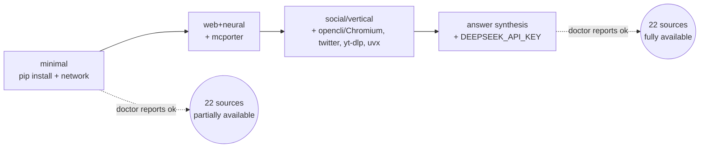
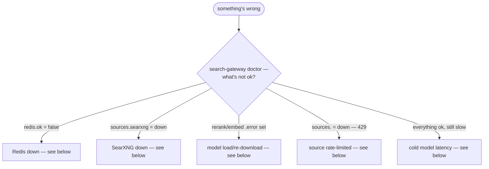

# Deployment

The gateway is a **host process**, not a container: it shells out to CLIs +
Chromium and uses a warm local Hugging Face model cache, so it does not
dockerize cleanly. Redis and SearXNG *do* dockerize. Deploy in capability tiers —
a fresh install degrades explicitly, and `search-gateway doctor` is the tier
report.



## Capability tiers



Each tier is additive — nothing in a lower tier stops working when you add a
higher one, and nothing in a higher tier is required to use a lower one.

| Tier | Sources | Requires |
|------|---------|----------|
| **minimal** | arxiv, openalex, crossref, stackoverflow, github, web/`read_url` (+ searxng if up) | `pip install .` + network |
| **web+neural** | + exa | `mcporter` on PATH |
| **social/vertical** | + twitter, reddit, facebook, instagram, xiaohongshu, linkedin, youtube | `opencli`+Chromium, `twitter`, `yt-dlp`, `uvx` |
| **answer synthesis** | `research_answer`, query expansion | `DEEPSEEK_API_KEY` |

## 1. Native install

```bash
git clone <this-repo> && cd search-gateway
pip install .                  # or: pip install -e . for development
search-gateway --help
search-gateway check           # gate: 23 sources + Redis reachable
```

Optional report-tooling extras:

```bash
pip install '.[report]'        # matplotlib, weasyprint, python-docx, playwright
```

The re-ranker runs on ONNX Runtime by default (dynamic-quantized INT8),
~2× faster than torch with a smaller footprint — no extra install step, it's a
core dependency:

```bash
search-gateway serve                                        # onnx_int8 by default
SEARCH_GATEWAY_INFERENCE_BACKEND=torch search-gateway serve # original torch path
```

`onnx_int8` uses the pre-exported `onnx-community/bge-reranker-v2-m3-ONNX`
model, downloaded on first load; if it can't load, the reranker falls back to
torch automatically. Measured: rerank 30 pairs ~3s vs ~6s on torch, RSS ~1.6GB
vs ~2.6GB, ranking agreement Spearman ≈ 0.96.

## 2. Services (Redis + SearXNG)

```bash
cd infra
docker compose up -d           # redis (AOF) + searxng (JSON, :8888)
search-gateway doctor          # both should report ok
```

Verified: `docker compose config` parses clean, and the searxng image mounts a
JSON-enabled `settings.yml`. Without Docker, run Redis and SearXNG natively and
point `SEARCH_GATEWAY_REDIS_URL` / `SEARXNG_BASE` at them.

## 3. Run as a host process

**stdio (default — client-spawned):** register the console script in your MCP
client (`docs/mcp-registration.md`); the client spawns `search-gateway` per
session.

**HTTP (long-running — systemd):**

```bash
mkdir -p ~/.config/search-gateway && touch ~/.config/search-gateway/gateway.env
chmod 600 ~/.config/search-gateway/gateway.env   # put DEEPSEEK_API_KEY etc. here
cp infra/systemd/search-gateway@.service ~/.config/systemd/user/
systemctl --user daemon-reload
systemctl --user enable --now search-gateway@8765.service
```

The unit runs `search-gateway check` before start (`ExecStartPre`), installs
and reports the L3 egress filter for its own cgroup, restarts on failure, logs
JSON to the journal, and keeps models warm across client disconnects. `%i` is
the HTTP port. Hardening (0.4.2): `LoadCredential=` for vault secrets,
`NoNewPrivileges`, `PrivateTmp`, `ProtectSystem=strict` (+ `ReadWritePaths`
for the vault/profile dirs and the HF cache), `RestrictAddressFamilies`,
`IPAddressDeny` for the service-level floor. Verified: `systemd-analyze
verify` exits 0 on the shipped unit; the HTTP transport answers `tools/list`
with 14 tools.

## 3.1 Secrets vault (0.4.1+)

Since 0.4.1, secrets live in the per-persona vault
`~/.agent-reach/profiles/<persona>/` (0600 files, 0700 dirs — decision D7.3).
One-time migration from the legacy flat files:

```bash
search-gateway vault migrate --dry-run   # what would move (shows paths + status)
search-gateway vault migrate             # moves twitter.env / deepseek.env / proxy.env
search-gateway vault status              # layout + hygiene (modes, symlinks, staleness)
search-gateway doctor                    # `vault` section: hygiene ok + no legacy_in_use
```

The legacy flat paths (`~/.agent-reach/twitter-auth.env` etc.) were honored
through 0.4.2 and **removed in 0.4.3** (D7.3) — migrate before upgrading past
0.4.2 on any machine that never ran the migration. `gateway.env` for tests
(`~/.agent-reach/gateway.env`)
is the *test* environment, not a profile secret — the migration leaves it in
place by design.

For a host-process deployment under systemd, prefer `LoadCredential=` over
`EnvironmentFile=` for the vault secrets: secrets arrive as files in
`$CREDENTIALS_DIRECTORY` and never touch the process environment (systemd's
own doctrine — see `docs/security.md`). The hardened unit in 0.4.2 ships this;
manual setups can pass `SEARCH_GATEWAY_CREDENTIALS_DIR` in the unit pointing
at the credential mount directory.

## 3.2 Kernel egress filter (0.4.2, decision D7.1)

Browser-tier operations **refuse to launch** until the L3 nftables egress
filter is installed (the explicit `blocked (egress-unhardened)` message names
it). The filter is an nftables `socket cgroupv2` rule set: sockets opened by
browser children in a scoped cgroup are dropped when they target any
private/link-local/metadata range — no suid binary, no kernel module
(LESSONS.md §1.5, pam_authnft pattern).

**Ad-hoc gateway** (browser children wrapped in a transient scope):

```bash
# one-time install, from INSIDE the scope that will wrap browser children:
systemd-run --user --scope --unit=sg-egress -- \
  search-gateway harden --install --sudo
search-gateway harden --status       # installed + covered
search-gateway harden --check        # browser-tier enforceability report
```

With the filter live, `run_opencli` automatically wraps each browser child in
`systemd-run --user --scope --unit=sg-egress` (serialized — keep
`SEARCH_GATEWAY_BROWSER_BUDGET=1` in ad-hoc scoped mode). For the Camoufox
anonymous tier the *gateway itself* must run inside the scope (Camoufox
spawns its own children):

```bash
systemd-run --user --scope --unit=sg-egress -- search-gateway serve
```

**systemd deployment**: the hardened unit's `ExecStartPre` chain runs
`harden --install` (writes the ruleset for the unit's own cgroup — browser
children inherit it), then **auto-loads it** with `sudo nft -f
~/.config/search-gateway/sg-egress.nft`, then reports `harden --status`.
Because nft rules are volatile (they do NOT survive reboot), the auto-load
needs a sudoers drop-in — create it once (PHASE8 Plan 7, option B):

```bash
sudo tee /etc/sudoers.d/search-gateway-nft > /dev/null <<'SUDOERS'
Defaults:kbj !requiretty
kbj ALL=(root) NOPASSWD: /usr/bin/nft -f /home/kbj/.config/search-gateway/sg-egress.nft
SUDOERS
sudo chmod 440 /etc/sudoers.d/search-gateway-nft
```

Without the drop-in, load the ruleset by hand after each boot (`sudo nft -f
~/.config/search-gateway/sg-egress.nft`). Uninstall:
`search-gateway harden --uninstall`. Sandboxed CI that cannot run nft sets
`SEARCH_GATEWAY_HARDEN=permissive` — the explicit opt-out, not the default.

## 4. Headless tier-1 image (CI / academic-only)

```bash
docker build -f infra/Dockerfile -t search-gateway .
docker run --rm -p 8765:8765 search-gateway
```

No models, no browser CLIs — the "minimal" tier only. **Not yet validated:** the
GitHub-hosted CI run and the Docker image build (they run in CI on push; see
`.github/workflows/ci.yml`).

## 5. External dependencies (machine-level)

| Dep | Default | Override |
|-----|---------|----------|
| Redis | `redis://127.0.0.1:6379/0` | `SEARCH_GATEWAY_REDIS_URL` |
| SearXNG | `http://127.0.0.1:8888` | `SEARXNG_BASE` |
| DeepSeek | `https://api.deepseek.com` + key | `DEEPSEEK_API_KEY` / `DEEPSEEK_BASE_URL` |
| `opencli` + Chromium | social sources | `SEARCH_GATEWAY_OPENCLI_PROFILES` |
| `twitter` (twitter-cli) | twitter primary | — |
| `mcporter` | exa + linkedin | — |
| `yt-dlp` | youtube | — |
| `uvx` | linkedin | — |
| HF models (`~/.cache/huggingface`) | reranker · MiniLM · bge-m3 | model env vars + `*_REVISION` |
| arXiv / OpenAlex / Crossref / S2 / StackExchange | HTTP, no key | — |

`agent-reach` is a separate ecosystem: the gateway shells out to its CLIs but
does not bundle it.

## Troubleshooting



**Reading `doctor`.** Run `search-gateway doctor` and read top-down: `redis`
and `sources` are the two fields `search-gateway check`'s exit code depends
on (`health.check()` fails if `len(ALL_SOURCES) != 23` or `redis.ok` is
false); `rerank`/`embed`/`llm` are soft signals that degrade the pipeline
without failing it. Since 0.4.1 the report also carries the containment
sections — `egress` (floor state + denial counters), `vault` (hygiene),
`blocks` (block-event reservoir), `profiles` (browser profile farm) — read
`vault.hygiene.ok` and `egress.floor.enabled` when auditing a host.
`stats_report` adds the rolling reliability/latency numbers `doctor` doesn't
carry, plus the same `blocks` reservoir.

**Redis down.** `cache.ping()` catches `redis.RedisError` and returns
`{"ok": false, "error": "<message>"}` — `doctor` surfaces this directly, and
`search-gateway doctor`'s exit code is `0` only when `redis.ok` is true. With
Redis down, `search` still returns results (every `cache.py` call site
catches `RedisError` and treats it as a miss/no-op), but every search pays
full source latency and per-source reliability weighting from `stats.py`
degrades to `1.0` for everyone (no history to read).

**SearXNG down.** Appears as `sources.searxng = "down — <reason>"` in
`doctor`. `search`, `search_web`, `search_news`, and `search_science` all
lose SearXNG's contribution to fusion but still return results from every
other fanned-out source — SearXNG is one of 22 sources, not a dependency of
the pipeline itself.

**Model re-download.** If `rerank.error` or `embed.error` mentions a network
fetch when you expected a cache hit, the pinned `*_REVISION` sha may not
match what's on disk (e.g. after a manual `huggingface-cli` operation).
Clear the affected model from `~/.cache/huggingface` and let
`search-gateway warm` re-fetch it once against the pinned revision — that's
the intended recovery path, not an unpinned override.

**Source 429s.** `doctor`'s `academic.<source>.rate_limited` flag is `true`
when that source's status string contains `"429"` or `"rate"` — check
`stats_report` for that source's `reliability` trend over the last 24h; a
sustained drop is `fusion.py`'s weighted RRF already compensating, and no
action may be needed beyond waiting out the window.

**Warm vs. cold model latency.** A cold process pays the full cross-encoder +
bi-encoder load time on its first `search` call — expect roughly 30 seconds.
`search-gateway warm` (or the systemd unit's warm-keep-alive behavior)
front-loads that cost so it never lands on a live request; `search-gateway
doctor`'s `rerank.loaded`/`embed.loaded` flags confirm whether the warm-up
already happened in this process.

**Redis AOF backup.** `infra/docker-compose.yml` enables Redis AOF, so
`saved_queries` and the reliability counters in `stats.py` survive a
container restart. Back up the AOF file (`appendonly.aof` under the Redis
data volume) before any `docker compose down -v` — that flag deletes volumes,
and an AOF backup is the only way to recover saved queries after it.

## Upgrade path

```bash
pip install -U .                    # or: pip install -U search-gateway (if published)
search-gateway version              # confirm the bump
search-gateway check                # re-verify 23 sources + Redis after upgrade
```

A minor bump (e.g. `0.2.0` → `0.3.0`) may add a tool — re-read
`docs/api/tools.md` for anything new, but nothing existing breaks. A major
bump changes a tool's surface or a `Result` field; read the changelog entry
and `docs/architecture.md#versioning` before upgrading a production
deployment.

Changing a pinned model revision (`SEARCH_GATEWAY_RERANK_REVISION`,
`SEARCH_GATEWAY_EMBED_REVISION`, `SEARCH_GATEWAY_EMBED_CJK_REVISION`) is a
separate, independent upgrade: set the new sha, then run `search-gateway
warm` to force the re-fetch against it rather than waiting for the first live
query to pay that cost. Un-pinning (setting the var to an empty string) is
supported but re-introduces the commit-churn re-download risk
`docs/adrs/0005-pinned-model-revisions.md` exists to prevent.