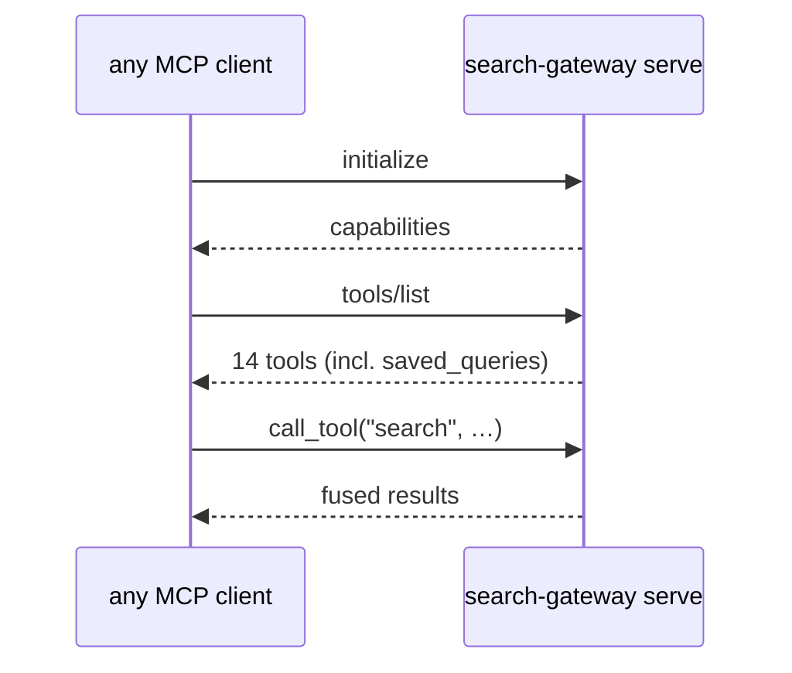

# MCP Registration

Any MCP client can drive the gateway. The stdio `initialize` → `tools/list`
handshake is the conformance check — verify it with a raw client before
trusting any client's config. `tests/test_mcp_handshake.py` automates exactly
that (including the bare `search-gateway` command, which is what MCP configs
actually run).



## stdio (client-spawned — default)

`mcp.json` (repo root) or your client's equivalent:

```jsonc
{
  "mcpServers": {
    "search-gateway": {
      "command": "search-gateway",
      "env": { "SEARCH_GATEWAY_REDIS_URL": "redis://127.0.0.1:6379/0" }
    }
  }
}
```

### OpenCode

In `opencode.jsonc`:

```jsonc
"mcp": {
  "search-gateway": {
    "type": "local",
    "command": ["search-gateway"],
    "enabled": true
  }
}
```

### Claude Code

```bash
claude mcp add search-gateway -- search-gateway
```

## HTTP (long-running host process)

Point a streamable-HTTP client at the systemd-managed server
(`infra/systemd/search-gateway@.service`):

```jsonc
{
  "mcpServers": {
    "search-gateway": {
      "type": "http",
      "url": "http://127.0.0.1:8765/mcp/"
    }
  }
}
```

## Conformance

Verify without any client:

```bash
search-gateway serve   # then send JSON-RPC initialize + tools/list over stdio
# or, over HTTP:
curl http://127.0.0.1:8765/mcp/
```

`tests/test_mcp_handshake.py` automates the stdio handshake (bare command and
explicit `serve`); `tests/test_contract.py` asserts the 18 sources + 14 tools +
`Result.meta` keys are unchanged.
