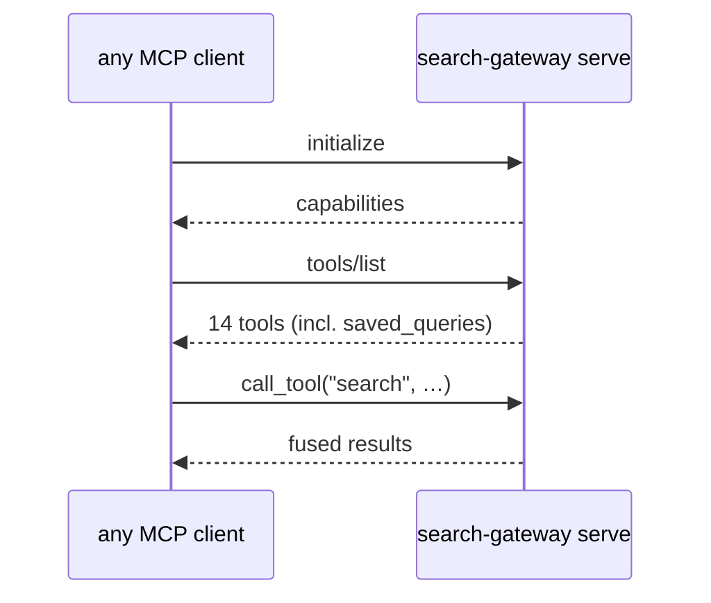

# MCP Registration

Any MCP client can drive the gateway. The stdio `initialize` → `tools/list`
handshake is the conformance check — verify it with a raw client before
trusting any client's config. `tests/test_mcp_handshake.py` automates exactly
that (including the bare `search-gateway` command, which is what MCP configs
actually run).



## stdio vs HTTP tradeoff

| | stdio (default) | HTTP / SSE |
|---|---|---|
| Who starts the process | the client, per session | you, once (systemd/manual) |
| Lifecycle | one process per session; model cache re-warms per spawn unless the client reuses the process | one long-running process; models stay warm across every client session |
| Config shape | `command` (+ `args`/`env`) | `url` |
| Latency on first query | pays cold-model-load cost if the client just spawned it | pays it once, at service start |
| Failure mode | client sees a spawn/exit failure directly | client sees a connection failure; server-side crash needs `journalctl`/logs |
| Best for | desktop IDEs, single-user CLIs | shared hosts, multiple clients, always-on setups |

Both transports serve the identical 14-tool surface — the choice is
operational, not functional. `docs/deployment.md#3-run-as-a-host-process` has
the systemd unit for the HTTP path.

## stdio (client-spawned — default)

`mcp.json` (repo root) or your client's equivalent:

```jsonc
{
  "mcpServers": {
    "search-gateway": {
      "command": "search-gateway",
      "env": { "SEARCH_GATEWAY_REDIS_URL": "redis://127.0.0.1:6379/0" }
    }
  }
}
```

### OpenCode

In `opencode.jsonc`:

```jsonc
"mcp": {
  "search-gateway": {
    "type": "local",
    "command": ["search-gateway"],
    "enabled": true
  }
}
```

### Claude Code

```bash
claude mcp add search-gateway -- search-gateway
```

### Cursor

`~/.cursor/mcp.json` (global) or `.cursor/mcp.json` (project), same
`mcpServers` shape as the generic `mcp.json` above:

```jsonc
{
  "mcpServers": {
    "search-gateway": {
      "command": "search-gateway",
      "env": { "DEEPSEEK_API_KEY": "" }
    }
  }
}
```

### Windsurf

`~/.codeium/windsurf/mcp_config.json`:

```jsonc
{
  "mcpServers": {
    "search-gateway": {
      "command": "search-gateway"
    }
  }
}
```

### Zed

`~/.config/zed/settings.json`, under `context_servers` (Zed nests the
executable under a `command` object rather than taking a bare string):

```jsonc
{
  "context_servers": {
    "search-gateway": {
      "source": "custom",
      "command": {
        "path": "search-gateway",
        "args": []
      }
    }
  }
}
```

### VS Code

`.vscode/mcp.json` (workspace) or the user profile equivalent, under
`servers` with an explicit `type` (VS Code's schema differs from the
`mcpServers`/bare-command convention the others share):

```jsonc
{
  "servers": {
    "search-gateway": {
      "type": "stdio",
      "command": "search-gateway"
    }
  }
}
```

## HTTP (long-running host process)

Point a streamable-HTTP client at the systemd-managed server
(`infra/systemd/search-gateway@.service`):

```jsonc
{
  "mcpServers": {
    "search-gateway": {
      "type": "http",
      "url": "http://127.0.0.1:8765/mcp/"
    }
  }
}
```

## Conformance

Verify without any client:

```bash
search-gateway serve   # then send JSON-RPC initialize + tools/list over stdio
# or, over HTTP:
curl http://127.0.0.1:8765/mcp/
```

`tests/test_mcp_handshake.py` automates the stdio handshake (bare command and
explicit `serve`); `tests/test_contract.py` asserts the 18 sources + 14 tools +
`Result.meta` keys are unchanged.

## Troubleshooting

| Symptom | Cause | Fix |
|---------|-------|-----|
| Client reports `-32000: Connection closed` immediately after spawn | The server crashed on startup, before completing the MCP handshake — this is not a protocol-level error, it's the client observing a dead process. | Run `search-gateway check` manually first. A non-zero exit (18-source count mismatch or Redis unreachable) is almost always the cause; fix that, then retry the client. |
| Client says the command isn't found | `search-gateway` isn't on the `PATH` the client's spawned process sees — GUI apps on macOS/Linux often don't inherit your shell's `PATH`. | Use the full path to the console script (`which search-gateway` in the shell where `pip install` ran) in the client's `command` field, or launch the client from a shell that has the venv activated. |
| Server listed but never called | Client-specific `enabled`/toggle flag is off — OpenCode's config has an explicit `"enabled": true`; other clients gate registration behind a UI toggle even after the config is saved. | Check the client's MCP server list UI/config for a disabled state independent of the JSON config being correct. |
| stdio works, HTTP doesn't | The systemd unit isn't running, or the port doesn't match. | `systemctl --user status search-gateway@8765.service`; confirm the port in the unit matches the client's `url`. |
| Works once, then times out on every subsequent call | A source, not the server, is hanging — check `pending` in the `search` response envelope. | This isn't a registration problem; see `docs/deployment.md#troubleshooting` for source-level diagnosis. |

Every row above traces back to the same first move: run `search-gateway
check` (or `doctor` for the full picture) before assuming the client
integration is broken. Most "the MCP server doesn't work" reports are the
server failing its own startup gate, not a transport or client bug.