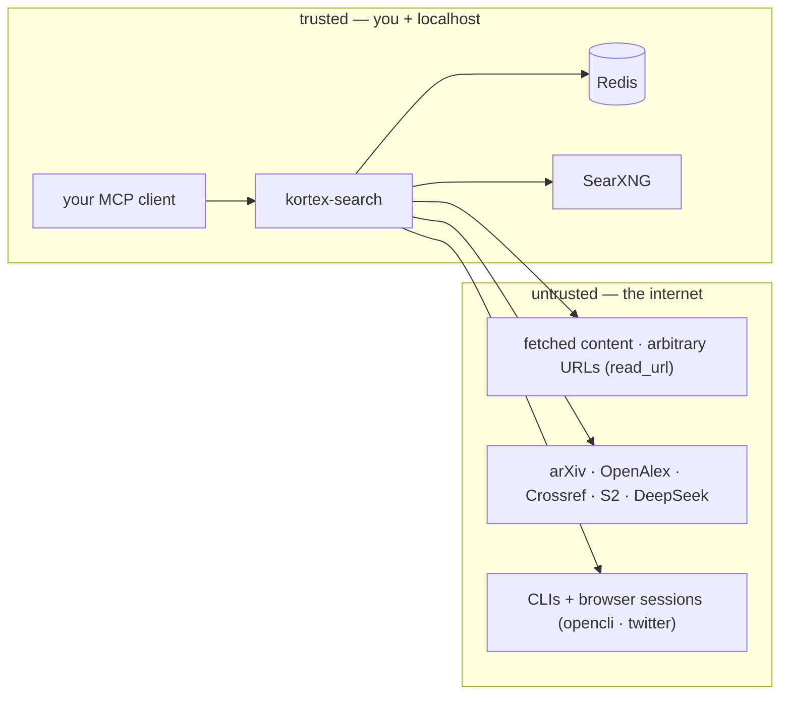

# Security & Threat Model

This is a local, best-effort MCP server — not a sandbox, not a network service
by default. The trust boundary is small, and drawing it keeps the mitigations
honest:

The server fetches from the untrusted side at your request, synthesizes with
DeepSeek, and never exposes a secret to it. The mitigations below are the
specifics.

| Threat | Mitigation |
|--------|-----------|
| Untrusted fetched content → DeepSeek (prompt injection) | `research_answer` prompt is scoped "use ONLY the numbered sources"; synthesis refuses out-of-scope. Best-effort, **not** a sandbox. |
| Social auth tokens in subprocess env (`TWITTER_AUTH_TOKEN` / `CT0`) | child-process env only, never logged; `.gitignore` blocks `*.env`; `doctor`/`check` never echo secrets. |
| Model download supply chain | pinned `*_REVISION` (empty = unpinned) fixes commit-churn re-downloads and pins provenance. |
| `read_url` fetching arbitrary URLs (SSRF) | **L1 egress floor (0.4.1)** blocks private/link-local/metadata egress pre-nav AND post-redirect (the whole `169.254.0.0/16`, RFC1918, CGNAT, cloud IMDS ranges — LESSONS.md §1.5: the hermes-agent IAM-credential incident class). Denials surface as `blocked (egress-floor/…)` with telemetry. **L2 (0.4.2)**: the anonymous browser tier is forced through a loopback CONNECT proxy that re-checks every target; **L3 (0.4.2)**: an nftables per-cgroup DROP table covers browser children at the kernel — browser ops refuse to launch until it is installed (D7.1). |
| Secret leakage via logs | logs go to stderr with `KORTEX_SEARCH_LOG_FMT`; JSON formatter never serializes env/tokens. |
| Saved-query loss on Redis reset | Redis AOF enabled in `infra/docker-compose.yml`; backup documented in `docs/deployment.md`. |
| Secrets on disk (mode/symlink/stale) | per-persona vault `~/.agent-reach/profiles/<persona>/` (0600/0700, decision D7.3); `kortex-search vault status` hygiene checks (modes, symlink escapes, stale files, out-of-vault config) with doctor red findings. |

## Per-tool attack surface

Not every tool touches the untrusted side the same way — this walks the 14
tools by what they actually reach, so "is this tool safe to expose" has a
concrete answer instead of a blanket one.

| Tool | Reaches | Attack surface |
|------|---------|-----------------|
| `search` / `search_web` / `search_news` / `search_science` / `search_academic` / `search_social` | up to 18 third-party APIs/CLIs, chosen by the caller via `sources` | The caller picks the source list — no privilege escalation, since every source is already reachable via `ALL_SOURCES`; the risk is purely upstream (a compromised or malicious search backend returning adversarial content), not a gateway-side vulnerability. |
| `get_paper` / `get_citations` / `get_references` | Crossref, OpenAlex, arXiv, Semantic Scholar | Same shape as search — read-only, keyless HTTP APIs. `GITHUB_TOKEN`, the only credential these paths could brush against indirectly, is never passed to non-GitHub sources. |
| `research_answer` | search sources + DeepSeek | The one place untrusted fetched content reaches an LLM. The prompt's scoping line ("use ONLY the numbered sources… if the sources don't answer it, say so") is the only mitigation — this is prompt-level, not sandboxed, so a sufficiently adversarial page in the result set could still attempt injection. Treat `research_answer` output as advisory, not as ground truth to act on unreviewed. |
| `read_url` | any URL the caller passes | The most direct untrusted-content path in the surface: fetches an arbitrary URL as Markdown via Jina Reader and returns the raw text. It is a **local, user-initiated fetch** — there's no server-side credential it could exfiltrate, since the fetch happens with no auth header of the gateway's. The realistic risk is fetching something the user didn't intend to (SSRF-style if the URL came from an untrusted upstream source rather than the user directly) — mitigated since 0.4.1 by the L1 egress floor at the tool entry AND inside every read stage (pre-nav + post-redirect). |
| `doctor` / `stats_report` | Redis, all 22 sources' `available()` probes, the ledger directory | Read-only introspection. Status strings never include secret values — `health.report()` returns `"ok"`/`"down — <reason>"` strings, not raw exception payloads containing credentials. |
| `saved_queries` | Redis only, plus whatever `run`/`diff` re-triggers through `orchestrator.search()` | `save`/`list`/`delete` never leave Redis. `run`/`diff` inherit the same attack surface as `search` itself, scoped to whatever `sources` was saved with. |

The pattern across all 14: nothing in this server holds a secret that a tool
call can leak, because the two places secrets exist —
`DEEPSEEK_API_KEY`/`GITHUB_TOKEN`/social auth env — are read once into memory
and passed only as outbound `Authorization` headers to their own API, never
echoed back into a tool's return value.

## Hardening checklist

- **Pre-push secret scan.** Run a secret scanner (e.g. `gitleaks`,
  `detect-secrets`) before every push — `.gitignore` blocking `*.env` prevents
  accidental commits, but doesn't catch a secret pasted into a commit message
  or a debug print left in a diff.
- **Token rotation.** Rotate `DEEPSEEK_API_KEY`, `GITHUB_TOKEN`, and the
  social auth tokens in the per-persona vault (`~/.agent-reach/profiles/<persona>/`)
  on a fixed schedule, not just after a suspected leak — cookie-based social
  auth in particular has a shorter natural expiry, and a stale token failing
  silently is a worse failure mode than a rotation reminder.
- **Minimal permissions.** `GITHUB_TOKEN` needs read-only public-repo scope
  for the GitHub source's rate-limit boost — nothing here needs write access
  to anything. Scope it down explicitly rather than reusing a broader
  personal token.
- **`LOG_FMT` in production.** Set `KORTEX_SEARCH_LOG_FMT=json` for any
  host-process deployment (`docs/deployment.md`'s HTTP/systemd path) — one
  JSON object per line is what makes `journalctl`/log-aggregation queries
  possible; the `text` default is for interactive/local use only.
- **Kernel egress floor (0.4.2).** Browser-tier operations refuse to launch
  without the L3 nftables filter (D7.1): `kortex-search harden --install
  --sudo`, and for systemd deployments the shipped unit's `ExecStartPre`
  installs it for the unit's cgroup. `permissive` (`KORTEX_SEARCH_HARDEN`)
  is the explicit opt-out for sandboxed CI only — an operator who disables it
  outside CI is disabling the containment envelope's last layer on purpose.
- **Review `research_answer` output before acting on it.** Given the prompt
  injection surface above, treat its `answer` field as a summary to verify
  against `results[]`, not as a pre-validated fact — the tool's own
  scoping instruction is the only defense, and it's a best-effort prompt
  constraint, not a guarantee.

## Secret handling

- Secrets live in the per-persona vault `~/.agent-reach/profiles/<persona>/`
  (0600 files, 0700 dirs) — outside the repo. Migrate legacy flat files with
  `kortex-search vault migrate` (decision D7.3); legacy paths are honored one
  release window (D7.3) — removed in 0.4.3; migrate before upgrading past 0.4.2.
- `.env.example` ships placeholders only; `.gitignore` blocks `.env`, `*.env`,
  `*.pem`, `*.key`, `*.log`.
- The systemd unit reads `~/.config/kortex-search/gateway.env` (0600) via
  `EnvironmentFile=` — that file is never committed. The hardened unit
  (0.4.2) additionally passes vault secrets via `LoadCredential=` so they
  arrive as files, never env vars (systemd's own doctrine, LESSONS.md §1.5).
- `log.py`'s `JsonFormatter` constructs its payload from exactly five fields
  (`ts`, `level`, `logger`, `msg`, `exc`) — it does not serialize arbitrary
  record attributes, so an accidental `logger.info(os.environ)` call would
  still leak via `msg`, but there is no broad-serialization path that could
  leak a secret passed as a *keyword* logging argument.
## Static analysis & dependency posture (0.6.1+)

- **ruff** (rules `E F W I B C4 UP SIM RUF FURB S DTZ BLE ASYNC PT`),
  **bandit** (`bandit -c pyproject.toml -r kortex_search -ll`), **pip-audit**
  (`pip-audit -l`), and **gitleaks** run in CI (see `.github/workflows/ci.yml`
  `security` job). Bandit skips live in `[tool.bandit]` with per-code
  rationales.
- **transformers is pinned `<4.58`** (the optimum-onnx 0.1.0 ceiling). Four
  RCE advisories (CVE-2025-14929, CVE-2026-1839, CVE-2026-4372,
  CVE-2026-5241) fix only in 5.x. Accepted risk, mitigated: every model load
  uses a **git-SHA-pinned revision** of a fixed, trusted repo
  (`*_REVISION` env vars, ADR-0005) — SHAs are content-addressed, so a
  compromised upstream cannot alter a pinned snapshot. Re-evaluate when
  optimum-onnx ships a transformers-5-compatible release.
- **torch>=2.13** clears PYSEC-2025-194; the transitive set (idna, soupsieve,
  lxml-html-clean, gitpython, pillow) is kept current by pip-audit.
- **httpx stewardship**: upstream httpx activity has wound down and the
  ecosystem is migrating to `httpx2` (Pydantic-led fork, drop-in API).
  Tracked; not yet migrated — a networking dependency swap needs its own
  test-and-rollback window, not a sweep.
