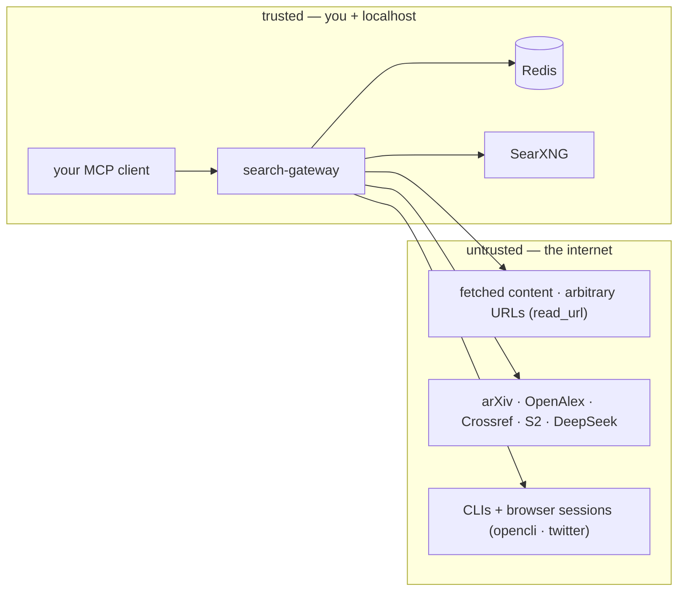

# Security & Threat Model

This is a local, best-effort MCP server — not a sandbox, not a network service
by default. The trust boundary is small, and drawing it keeps the mitigations
honest:

The server fetches from the untrusted side at your request, synthesizes with
DeepSeek, and never exposes a secret to it. The mitigations below are the
specifics.

| Threat | Mitigation |
|--------|-----------|
| Untrusted fetched content → DeepSeek (prompt injection) | `research_answer` prompt is scoped "use ONLY the numbered sources"; synthesis refuses out-of-scope. Best-effort, **not** a sandbox. |
| Social auth tokens in subprocess env (`TWITTER_AUTH_TOKEN` / `CT0`) | child-process env only, never logged; `.gitignore` blocks `*.env`; `doctor`/`check` never echo secrets. |
| Model download supply chain | pinned `*_REVISION` (empty = unpinned) fixes commit-churn re-downloads and pins provenance. |
| `read_url` fetching arbitrary URLs (SSRF) | local, user-initiated tool; no secret-bearing reach beyond the user's own request. |
| Secret leakage via logs | logs go to stderr with `SEARCH_GATEWAY_LOG_FMT`; JSON formatter never serializes env/tokens. |
| Saved-query loss on Redis reset | Redis AOF enabled in `infra/docker-compose.yml`; backup documented in `docs/deployment.md`. |

## Secret handling

- Secrets live in `~/.agent-reach/*.env` (0600) — outside the repo.
- `.env.example` ships placeholders only; `.gitignore` blocks `.env`, `*.env`,
  `*.pem`, `*.key`, `*.log`.
- The systemd unit reads `~/.config/search-gateway/gateway.env` (0600) via
  `EnvironmentFile=` — that file is never committed.
